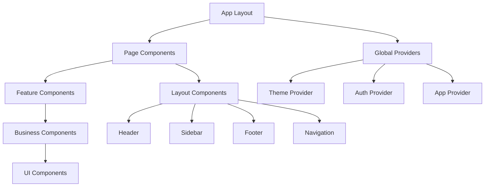
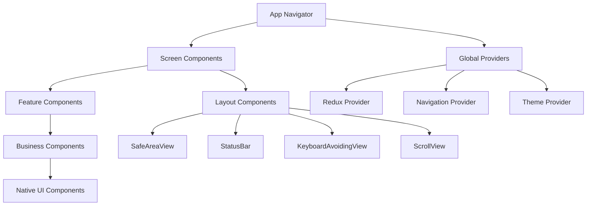

# 组件架构设计 (Component Architecture)

## 概述

本文档详细描述律时(LawClick)跨平台应用的组件架构设计，包括Web端(Next.js)和移动端(React Native)的组件层次结构、设计模式、数据流和最佳实践。

---

## 1. 组件架构原则

### 1.1 设计原则
- **单一职责**: 每个组件只负责一个功能
- **可复用性**: 组件设计考虑复用场景
- **可组合性**: 小组件组合成大组件
- **可测试性**: 组件易于单元测试
- **性能优化**: 避免不必要的重渲染

### 1.2 命名规范
- **组件名**: PascalCase (如: `UserProfile`)
- **文件名**: PascalCase.tsx (如: `UserProfile.tsx`)
- **Props接口**: ComponentNameProps (如: `UserProfileProps`)
- **样式类**: kebab-case (如: `user-profile`)

### 1.3 文件组织
```
components/
├── ui/                    # 基础UI组件
├── layout/               # 布局组件
├── business/             # 业务组件
├── forms/                # 表单组件
└── shared/               # 共享组件
```

---

## 2. 平台架构对比

### 2.1 Web端 vs 移动端组件架构

| 层级 | Web端 (Next.js) | 移动端 (React Native) |
|------|-----------------|----------------------|
| 应用层 | App Layout, Providers | App Navigator, Providers |
| 页面层 | Page Components | Screen Components |
| 功能层 | Feature Components | Feature Components |
| 业务层 | Business Components | Business Components |
| UI层 | HTML-based UI Components | Native UI Components |
| 布局层 | CSS-based Layout | Flexbox Layout |

### 2.2 共享组件策略
- **业务逻辑**: 跨平台共享hooks和utils
- **类型定义**: 统一的TypeScript类型
- **API客户端**: 共享的API调用逻辑
- **状态管理**: 相似的状态管理模式

---

## 3. Web端组件层次结构 (Next.js)

### 3.1 组件分层



#### 第一层: 应用层 (App Layer)
- **职责**: 全局配置、路由、状态管理
- **组件**: App, Layout, Providers
- **特点**: 单例、全局作用域

#### 第二层: 页面层 (Page Layer)
- **职责**: 页面级组件、路由处理
- **组件**: Dashboard, Calendar, Cases
- **特点**: 路由对应、数据获取

#### 第三层: 功能层 (Feature Layer)
- **职责**: 业务功能实现
- **组件**: CalendarView, CaseForm, TimeTracker
- **特点**: 业务逻辑、状态管理

#### 第四层: 业务层 (Business Layer)
- **职责**: 业务组件组合
- **组件**: EventCard, CaseCard, UserCard
- **特点**: 数据展示、用户交互

#### 第五层: UI层 (UI Layer)
- **职责**: 基础UI组件
- **组件**: Button, Input, Modal, Card
- **特点**: 无业务逻辑、高复用性

### 2.2 组件依赖关系

```typescript
// 依赖方向: 上层 → 下层
// ✅ 正确: Page → Feature → Business → UI
// ❌ 错误: UI → Business, Business → Feature

// 示例: 正确的依赖关系
// pages/calendar/page.tsx
import CalendarView from '@/components/calendar/CalendarView';

// components/calendar/CalendarView.tsx
import EventCard from '@/components/calendar/EventCard';
import Button from '@/components/ui/Button';

// components/calendar/EventCard.tsx
import Card from '@/components/ui/Card';
import Badge from '@/components/ui/Badge';
```

---

## 4. 移动端组件层次结构 (React Native)

### 4.1 组件分层



#### 第一层: 应用导航层 (App Navigator Layer)
- **职责**: 应用导航、路由管理、全局状态
- **组件**: AppNavigator, TabNavigator, StackNavigator
- **特点**: 原生导航体验、深度链接支持

#### 第二层: 屏幕层 (Screen Layer)
- **职责**: 屏幕级组件、页面逻辑
- **组件**: DashboardScreen, CalendarScreen, CasesScreen
- **特点**: 屏幕生命周期、导航参数处理

#### 第三层: 功能层 (Feature Layer)
- **职责**: 业务功能实现
- **组件**: CalendarView, CaseForm, TimeTracker
- **特点**: 平台无关的业务逻辑

#### 第四层: 业务层 (Business Layer)
- **职责**: 业务组件组合
- **组件**: EventCard, CaseCard, UserCard
- **特点**: 数据展示、用户交互

#### 第五层: 原生UI层 (Native UI Layer)
- **职责**: 原生UI组件
- **组件**: Button, Input, Modal, Card
- **特点**: 原生性能、平台适配

### 4.2 React Native核心组件

#### 原生Button组件
```typescript
// components/ui/Button.tsx (React Native版本)
import React from 'react';
import { TouchableOpacity, Text, StyleSheet, ActivityIndicator } from 'react-native';
import { ViewStyle, TextStyle } from 'react-native';

interface ButtonProps {
  title: string;
  onPress: () => void;
  variant?: 'primary' | 'secondary' | 'outline';
  size?: 'small' | 'medium' | 'large';
  loading?: boolean;
  disabled?: boolean;
  style?: ViewStyle;
}

const Button: React.FC<ButtonProps> = ({
  title,
  onPress,
  variant = 'primary',
  size = 'medium',
  loading = false,
  disabled = false,
  style,
}) => {
  const buttonStyles = [
    styles.button,
    styles[variant],
    styles[size],
    disabled && styles.disabled,
    style,
  ];

  const textStyles = [
    styles.text,
    styles[`${variant}Text`],
    styles[`${size}Text`],
  ];

  return (
    <TouchableOpacity
      style={buttonStyles}
      onPress={onPress}
      disabled={disabled || loading}
      activeOpacity={0.7}
    >
      {loading ? (
        <ActivityIndicator color="#ffffff" size="small" />
      ) : (
        <Text style={textStyles}>{title}</Text>
      )}
    </TouchableOpacity>
  );
};

const styles = StyleSheet.create({
  button: {
    borderRadius: 8,
    paddingVertical: 12,
    paddingHorizontal: 24,
    alignItems: 'center',
    justifyContent: 'center',
    marginVertical: 4,
  },
  primary: {
    backgroundColor: '#3b82f6',
  },
  secondary: {
    backgroundColor: '#6b7280',
  },
  outline: {
    backgroundColor: 'transparent',
    borderWidth: 1,
    borderColor: '#3b82f6',
  },
  small: {
    paddingVertical: 8,
    paddingHorizontal: 16,
  },
  medium: {
    paddingVertical: 12,
    paddingHorizontal: 24,
  },
  large: {
    paddingVertical: 16,
    paddingHorizontal: 32,
  },
  disabled: {
    opacity: 0.5,
  },
  text: {
    fontWeight: '600',
    textAlign: 'center',
  },
  primaryText: {
    color: '#ffffff',
  },
  secondaryText: {
    color: '#ffffff',
  },
  outlineText: {
    color: '#3b82f6',
  },
  smallText: {
    fontSize: 14,
  },
  mediumText: {
    fontSize: 16,
  },
  largeText: {
    fontSize: 18,
  },
});

export default Button;
```

#### 屏幕布局组件
```typescript
// components/layout/ScreenLayout.tsx
import React from 'react';
import {
  SafeAreaView,
  StatusBar,
  ScrollView,
  KeyboardAvoidingView,
  Platform,
  StyleSheet,
} from 'react-native';

interface ScreenLayoutProps {
  children: React.ReactNode;
  scrollable?: boolean;
  keyboardAvoiding?: boolean;
  statusBarStyle?: 'default' | 'light-content' | 'dark-content';
  backgroundColor?: string;
}

const ScreenLayout: React.FC<ScreenLayoutProps> = ({
  children,
  scrollable = false,
  keyboardAvoiding = false,
  statusBarStyle = 'dark-content',
  backgroundColor = '#ffffff',
}) => {
  const content = scrollable ? (
    <ScrollView
      style={styles.scrollView}
      contentContainerStyle={styles.scrollContent}
      showsVerticalScrollIndicator={false}
    >
      {children}
    </ScrollView>
  ) : (
    children
  );

  const wrappedContent = keyboardAvoiding ? (
    <KeyboardAvoidingView
      style={styles.keyboardAvoidingView}
      behavior={Platform.OS === 'ios' ? 'padding' : 'height'}
    >
      {content}
    </KeyboardAvoidingView>
  ) : (
    content
  );

  return (
    <SafeAreaView style={[styles.container, { backgroundColor }]}>
      <StatusBar barStyle={statusBarStyle} backgroundColor={backgroundColor} />
      {wrappedContent}
    </SafeAreaView>
  );
};

const styles = StyleSheet.create({
  container: {
    flex: 1,
  },
  scrollView: {
    flex: 1,
  },
  scrollContent: {
    flexGrow: 1,
  },
  keyboardAvoidingView: {
    flex: 1,
  },
});

export default ScreenLayout;
```

### 4.3 导航组件架构

#### 主导航器
```typescript
// navigation/AppNavigator.tsx
import React from 'react';
import { NavigationContainer } from '@react-navigation/native';
import { createStackNavigator } from '@react-navigation/stack';
import { createBottomTabNavigator } from '@react-navigation/bottom-tabs';
import Icon from 'react-native-vector-icons/MaterialIcons';

// 屏幕组件
import DashboardScreen from '../screens/DashboardScreen';
import CalendarScreen from '../screens/CalendarScreen';
import CasesScreen from '../screens/CasesScreen';
import TimeLogScreen from '../screens/TimeLogScreen';
import ProfileScreen from '../screens/ProfileScreen';

// 详情屏幕
import EventDetailsScreen from '../screens/EventDetailsScreen';
import CaseDetailsScreen from '../screens/CaseDetailsScreen';
import CreateEventScreen from '../screens/CreateEventScreen';

const Stack = createStackNavigator();
const Tab = createBottomTabNavigator();

// 底部标签导航
const TabNavigator = () => (
  <Tab.Navigator
    screenOptions={({ route }) => ({
      tabBarIcon: ({ focused, color, size }) => {
        let iconName: string;

        switch (route.name) {
          case 'Dashboard':
            iconName = 'dashboard';
            break;
          case 'Calendar':
            iconName = 'event';
            break;
          case 'Cases':
            iconName = 'folder';
            break;
          case 'TimeLog':
            iconName = 'access-time';
            break;
          case 'Profile':
            iconName = 'person';
            break;
          default:
            iconName = 'help';
        }

        return <Icon name={iconName} size={size} color={color} />;
      },
      tabBarActiveTintColor: '#3b82f6',
      tabBarInactiveTintColor: '#6b7280',
      headerShown: false,
    })}
  >
    <Tab.Screen
      name="Dashboard"
      component={DashboardScreen}
      options={{ tabBarLabel: '仪表盘' }}
    />
    <Tab.Screen
      name="Calendar"
      component={CalendarScreen}
      options={{ tabBarLabel: '日程' }}
    />
    <Tab.Screen
      name="Cases"
      component={CasesScreen}
      options={{ tabBarLabel: '案件' }}
    />
    <Tab.Screen
      name="TimeLog"
      component={TimeLogScreen}
      options={{ tabBarLabel: '工时' }}
    />
    <Tab.Screen
      name="Profile"
      component={ProfileScreen}
      options={{ tabBarLabel: '我的' }}
    />
  </Tab.Navigator>
);

// 主堆栈导航
const AppNavigator = () => (
  <NavigationContainer>
    <Stack.Navigator>
      <Stack.Screen
        name="Main"
        component={TabNavigator}
        options={{ headerShown: false }}
      />
      <Stack.Screen
        name="EventDetails"
        component={EventDetailsScreen}
        options={{ title: '事件详情' }}
      />
      <Stack.Screen
        name="CaseDetails"
        component={CaseDetailsScreen}
        options={{ title: '案件详情' }}
      />
      <Stack.Screen
        name="CreateEvent"
        component={CreateEventScreen}
        options={{
          title: '新建日程',
          presentation: 'modal',
        }}
      />
    </Stack.Navigator>
  </NavigationContainer>
);

export default AppNavigator;
```

---

## 5. 核心组件设计

### 3.1 基础UI组件

#### Button组件
```typescript
// components/ui/Button.tsx
interface ButtonProps {
  variant?: 'primary' | 'secondary' | 'outline' | 'ghost';
  size?: 'sm' | 'md' | 'lg';
  disabled?: boolean;
  loading?: boolean;
  children: React.ReactNode;
  onClick?: () => void;
  className?: string;
}

const Button: React.FC<ButtonProps> = ({
  variant = 'primary',
  size = 'md',
  disabled = false,
  loading = false,
  children,
  onClick,
  className = '',
}) => {
  const baseClasses = 'inline-flex items-center justify-center font-medium rounded-lg transition-colors focus:outline-none focus:ring-2 focus:ring-offset-2';
  
  const variantClasses = {
    primary: 'bg-blue-600 text-white hover:bg-blue-700 focus:ring-blue-500',
    secondary: 'bg-gray-600 text-white hover:bg-gray-700 focus:ring-gray-500',
    outline: 'border border-gray-300 text-gray-700 hover:bg-gray-50 focus:ring-blue-500',
    ghost: 'text-gray-700 hover:bg-gray-100 focus:ring-blue-500',
  };
  
  const sizeClasses = {
    sm: 'px-3 py-1.5 text-sm',
    md: 'px-4 py-2 text-base',
    lg: 'px-6 py-3 text-lg',
  };
  
  const classes = `${baseClasses} ${variantClasses[variant]} ${sizeClasses[size]} ${className}`;
  
  return (
    <button
      className={classes}
      disabled={disabled || loading}
      onClick={onClick}
    >
      {loading && (
        <svg className="animate-spin -ml-1 mr-2 h-4 w-4" fill="none" viewBox="0 0 24 24">
          <circle className="opacity-25" cx="12" cy="12" r="10" stroke="currentColor" strokeWidth="4" />
          <path className="opacity-75" fill="currentColor" d="M4 12a8 8 0 018-8V0C5.373 0 0 5.373 0 12h4zm2 5.291A7.962 7.962 0 014 12H0c0 3.042 1.135 5.824 3 7.938l3-2.647z" />
        </svg>
      )}
      {children}
    </button>
  );
};

export default Button;
```

#### Card组件
```typescript
// components/ui/Card.tsx
interface CardProps {
  variant?: 'default' | 'elevated' | 'outline';
  padding?: 'none' | 'sm' | 'md' | 'lg';
  children: React.ReactNode;
  className?: string;
  onClick?: () => void;
}

const Card: React.FC<CardProps> = ({
  variant = 'default',
  padding = 'md',
  children,
  className = '',
  onClick,
}) => {
  const baseClasses = 'bg-white rounded-lg transition-all';
  
  const variantClasses = {
    default: 'border border-gray-200',
    elevated: 'shadow-md hover:shadow-lg',
    outline: 'border-2 border-gray-300',
  };
  
  const paddingClasses = {
    none: '',
    sm: 'p-3',
    md: 'p-4',
    lg: 'p-6',
  };
  
  const classes = `${baseClasses} ${variantClasses[variant]} ${paddingClasses[padding]} ${className}`;
  
  if (onClick) {
    return (
      <button className={`${classes} cursor-pointer hover:bg-gray-50`} onClick={onClick}>
        {children}
      </button>
    );
  }
  
  return <div className={classes}>{children}</div>;
};

export default Card;
```

### 3.2 布局组件

#### MobileLayout组件
```typescript
// components/layout/MobileLayout.tsx
interface MobileLayoutProps {
  children: React.ReactNode;
  headerTitle?: string;
  headerAction?: React.ReactNode;
  showBackButton?: boolean;
  onBackClick?: () => void;
  showBottomNav?: boolean;
  className?: string;
}

const MobileLayout: React.FC<MobileLayoutProps> = ({
  children,
  headerTitle,
  headerAction,
  showBackButton = false,
  onBackClick,
  showBottomNav = true,
  className = '',
}) => {
  return (
    <div className="flex justify-center min-h-screen bg-gray-50">
      <div className="w-full max-w-md bg-white shadow-lg relative flex flex-col min-h-screen">
        {/* Header */}
        <Header
          title={headerTitle}
          action={headerAction}
          showBackButton={showBackButton}
          onBackClick={onBackClick}
        />
        
        {/* Main Content */}
        <main className={`flex-1 overflow-auto ${className}`}>
          {children}
        </main>
        
        {/* Bottom Navigation */}
        {showBottomNav && <BottomNavigation />}
      </div>
    </div>
  );
};

export default MobileLayout;
```

### 3.3 业务组件

#### EventCard组件
```typescript
// components/calendar/EventCard.tsx
interface EventCardProps {
  event: CalendarEvent;
  onClick?: (event: CalendarEvent) => void;
  showDate?: boolean;
  compact?: boolean;
}

const EventCard: React.FC<EventCardProps> = ({
  event,
  onClick,
  showDate = false,
  compact = false,
}) => {
  const getEventTypeColor = (type: string) => {
    const colors = {
      meeting: 'bg-blue-100 text-blue-800 border-blue-200',
      court: 'bg-red-100 text-red-800 border-red-200',
      deadline: 'bg-yellow-100 text-yellow-800 border-yellow-200',
      reminder: 'bg-green-100 text-green-800 border-green-200',
    };
    return colors[type as keyof typeof colors] || colors.meeting;
  };
  
  const getEventTypeIcon = (type: string) => {
    const icons = {
      meeting: '👥',
      court: '⚖️',
      deadline: '⏰',
      reminder: '🔔',
    };
    return icons[type as keyof typeof icons] || '📅';
  };
  
  return (
    <Card
      variant="elevated"
      className={`cursor-pointer hover:shadow-md transition-shadow ${
        compact ? 'p-3' : 'p-4'
      }`}
      onClick={() => onClick?.(event)}
    >
      <div className="flex items-start justify-between">
        <div className="flex items-start space-x-3 flex-1">
          <div className="text-lg">{getEventTypeIcon(event.type)}</div>
          <div className="flex-1 min-w-0">
            <h3 className={`font-medium text-gray-900 truncate ${
              compact ? 'text-sm' : 'text-base'
            }`}>
              {event.title}
            </h3>
            {event.description && !compact && (
              <p className="text-sm text-gray-600 mt-1 line-clamp-2">
                {event.description}
              </p>
            )}
            <div className={`flex items-center space-x-2 mt-2 ${
              compact ? 'text-xs' : 'text-sm'
            } text-gray-500`}>
              {showDate && (
                <span>{formatDate(event.startTime, { month: 'short', day: 'numeric' })}</span>
              )}
              <span>
                {formatTime(event.startTime)} - {formatTime(event.endTime)}
              </span>
              {event.location && (
                <span className="flex items-center">
                  <MapPinIcon className="w-3 h-3 mr-1" />
                  {event.location}
                </span>
              )}
            </div>
          </div>
        </div>
        <Badge
          variant={event.type === 'court' ? 'error' : 'info'}
          size={compact ? 'sm' : 'md'}
          className={getEventTypeColor(event.type)}
        >
          {event.type === 'meeting' ? '会议' :
           event.type === 'court' ? '法庭' :
           event.type === 'deadline' ? '截止' : '提醒'}
        </Badge>
      </div>
    </Card>
  );
};

export default EventCard;
```

---

## 4. 状态管理模式

### 4.1 组件状态分类

#### 本地状态 (Local State)
```typescript
// 使用useState管理组件内部状态
const [isOpen, setIsOpen] = useState(false);
const [formData, setFormData] = useState(initialData);
```

#### 共享状态 (Shared State)
```typescript
// 使用Context管理跨组件状态
const { user, isAuthenticated } = useAuth();
const { theme, toggleTheme } = useTheme();
```

#### 服务端状态 (Server State)
```typescript
// 使用SWR或React Query管理服务端数据
const { data: events, error, mutate } = useSWR('/api/calendar/events', fetcher);
```

### 4.2 状态提升策略

```typescript
// 状态提升示例
// 子组件需要共享状态时，将状态提升到最近的共同父组件

// ❌ 错误: 状态分散在各个子组件
const EventList = () => {
  const [selectedEvent, setSelectedEvent] = useState(null);
  // ...
};

const EventDetails = () => {
  const [selectedEvent, setSelectedEvent] = useState(null);
  // ...
};

// ✅ 正确: 状态提升到父组件
const CalendarPage = () => {
  const [selectedEvent, setSelectedEvent] = useState(null);
  
  return (
    <div>
      <EventList 
        selectedEvent={selectedEvent}
        onSelectEvent={setSelectedEvent}
      />
      <EventDetails event={selectedEvent} />
    </div>
  );
};
```

---

## 5. 组件通信模式

### 5.1 父子组件通信

#### Props Down, Events Up
```typescript
// 父组件
const ParentComponent = () => {
  const [data, setData] = useState([]);
  
  const handleAdd = (newItem) => {
    setData(prev => [...prev, newItem]);
  };
  
  return (
    <ChildComponent 
      data={data}           // Props Down
      onAdd={handleAdd}     // Events Up
    />
  );
};

// 子组件
interface ChildComponentProps {
  data: Item[];
  onAdd: (item: Item) => void;
}

const ChildComponent: React.FC<ChildComponentProps> = ({ data, onAdd }) => {
  return (
    <div>
      {data.map(item => <ItemCard key={item.id} item={item} />)}
      <Button onClick={() => onAdd(newItem)}>Add Item</Button>
    </div>
  );
};
```

### 5.2 兄弟组件通信

#### 通过共同父组件
```typescript
const ParentComponent = () => {
  const [sharedState, setSharedState] = useState(null);
  
  return (
    <div>
      <ComponentA 
        value={sharedState}
        onChange={setSharedState}
      />
      <ComponentB 
        value={sharedState}
        onChange={setSharedState}
      />
    </div>
  );
};
```

#### 通过Context
```typescript
const SharedStateContext = createContext();

const ParentComponent = () => {
  const [sharedState, setSharedState] = useState(null);
  
  return (
    <SharedStateContext.Provider value={{ sharedState, setSharedState }}>
      <ComponentA />
      <ComponentB />
    </SharedStateContext.Provider>
  );
};

const ComponentA = () => {
  const { sharedState, setSharedState } = useContext(SharedStateContext);
  // ...
};
```

---

## 6. 性能优化策略

### 6.1 React.memo
```typescript
// 使用React.memo防止不必要的重渲染
const ExpensiveComponent = React.memo<ExpensiveComponentProps>(({ data, config }) => {
  // 复杂的渲染逻辑
  return <div>{/* ... */}</div>;
}, (prevProps, nextProps) => {
  // 自定义比较函数
  return prevProps.data.id === nextProps.data.id &&
         prevProps.config.version === nextProps.config.version;
});
```

### 6.2 useMemo和useCallback
```typescript
const OptimizedComponent = ({ items, filter, onSelect }) => {
  // 缓存计算结果
  const filteredItems = useMemo(() => {
    return items.filter(item => item.category === filter);
  }, [items, filter]);
  
  // 缓存回调函数
  const handleSelect = useCallback((item) => {
    onSelect(item.id);
  }, [onSelect]);
  
  return (
    <div>
      {filteredItems.map(item => (
        <ItemCard 
          key={item.id} 
          item={item} 
          onSelect={handleSelect}
        />
      ))}
    </div>
  );
};
```

### 6.3 代码分割
```typescript
// 路由级别的代码分割
const CalendarPage = lazy(() => import('@/app/calendar/page'));
const CasesPage = lazy(() => import('@/app/cases/page'));

// 组件级别的代码分割
const HeavyComponent = lazy(() => import('@/components/HeavyComponent'));

const App = () => (
  <Suspense fallback={<LoadingSpinner />}>
    <Routes>
      <Route path="/calendar" element={<CalendarPage />} />
      <Route path="/cases" element={<CasesPage />} />
    </Routes>
  </Suspense>
);
```

---

## 7. 测试策略

### 7.1 单元测试
```typescript
// Button.test.tsx
import { render, screen, fireEvent } from '@testing-library/react';
import Button from './Button';

describe('Button Component', () => {
  it('renders with correct text', () => {
    render(<Button>Click me</Button>);
    expect(screen.getByText('Click me')).toBeInTheDocument();
  });
  
  it('calls onClick when clicked', () => {
    const handleClick = jest.fn();
    render(<Button onClick={handleClick}>Click me</Button>);
    
    fireEvent.click(screen.getByText('Click me'));
    expect(handleClick).toHaveBeenCalledTimes(1);
  });
  
  it('shows loading state', () => {
    render(<Button loading>Loading</Button>);
    expect(screen.getByRole('button')).toBeDisabled();
    expect(screen.getByTestId('loading-spinner')).toBeInTheDocument();
  });
});
```

### 7.2 集成测试
```typescript
// CalendarPage.test.tsx
import { render, screen, waitFor } from '@testing-library/react';
import { rest } from 'msw';
import { setupServer } from 'msw/node';
import CalendarPage from './page';

const server = setupServer(
  rest.get('/api/calendar/events', (req, res, ctx) => {
    return res(ctx.json([
      { id: '1', title: 'Meeting', startTime: '2025-01-15T10:00:00Z' }
    ]));
  })
);

beforeAll(() => server.listen());
afterEach(() => server.resetHandlers());
afterAll(() => server.close());

describe('Calendar Page', () => {
  it('displays events from API', async () => {
    render(<CalendarPage />);
    
    await waitFor(() => {
      expect(screen.getByText('Meeting')).toBeInTheDocument();
    });
  });
});
```

---

**文档版本**: v1.0  
**最后更新**: 2025年7月  
**维护人员**: 赵启睿  
**审核人员**: 赵启睿
