# 组件图 (Component Diagram)

## 概述

本文档描述律时(LawClick)跨平台系统的组件架构图，展示Web端(Next.js)和移动端(React Native + Expo)的模块划分、组件间的依赖关系和接口定义。

---

## 1. 系统整体组件架构

### 1.1 高层组件视图

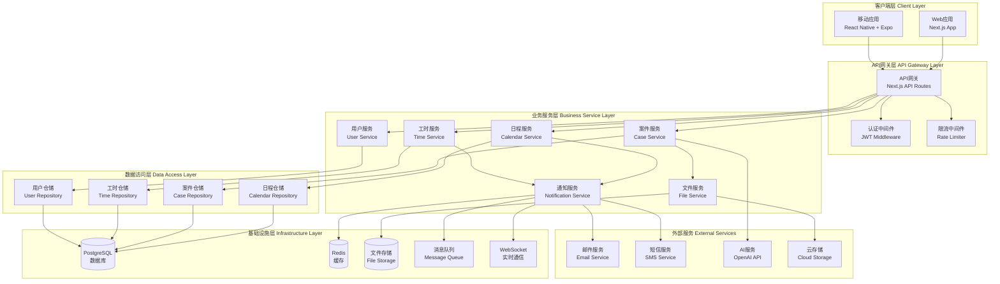

---

## 2. 跨平台架构对比

### 2.1 平台架构差异

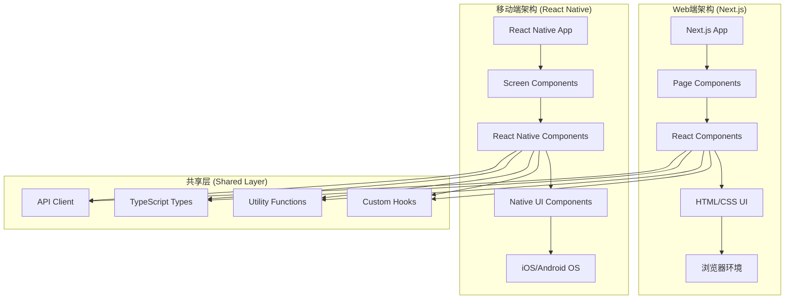

---

## 3. Web端组件架构 (Next.js)

### 3.1 React组件层次结构

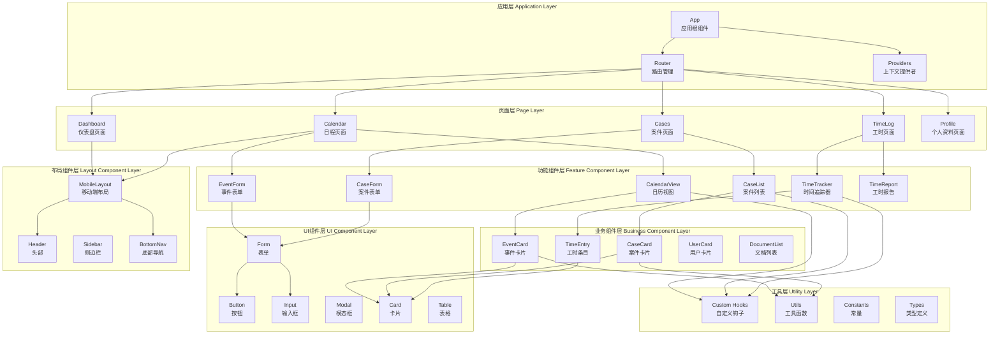

---

## 4. 移动端组件架构 (React Native + Expo)

### 4.1 React Native组件层次结构

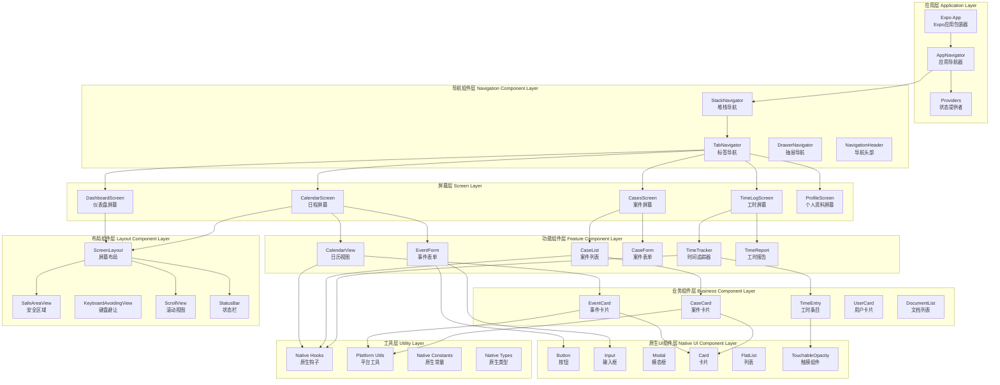

### 4.2 Expo特定组件

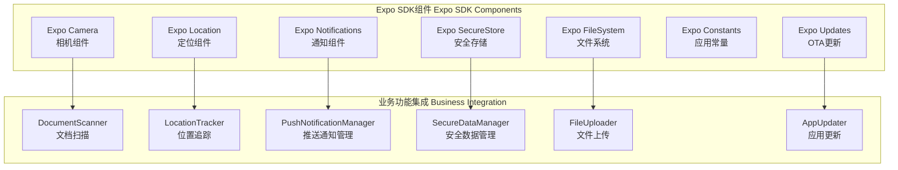

### 4.3 状态管理组件 (React Native)

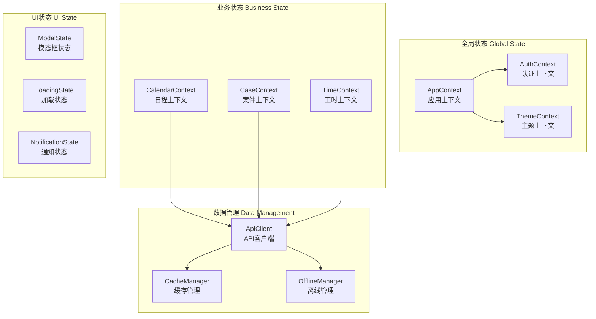

---

## 3. 后端服务组件架构

### 3.1 微服务组件视图

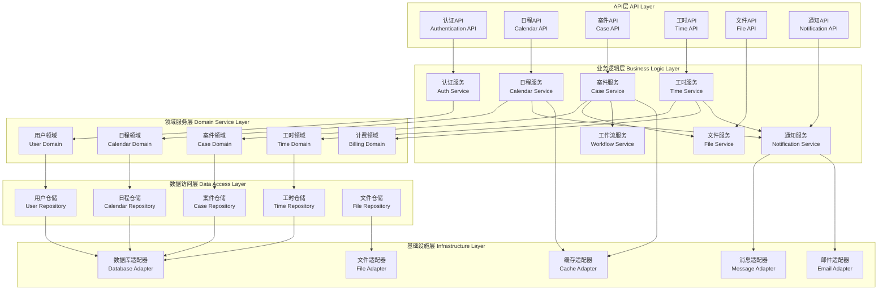

---

## 4. 接口定义

### 4.1 主要接口规范

#### ICalendarService接口
```typescript
interface ICalendarService {
  // 事件管理
  createEvent(eventData: CreateEventData): Promise<CalendarEvent>;
  updateEvent(eventId: string, updates: Partial<CalendarEvent>): Promise<CalendarEvent>;
  deleteEvent(eventId: string): Promise<boolean>;
  getEvent(eventId: string): Promise<CalendarEvent>;
  
  // 事件查询
  getEventsByDateRange(startDate: Date, endDate: Date): Promise<CalendarEvent[]>;
  getEventsByUser(userId: string): Promise<CalendarEvent[]>;
  getEventsByCase(caseId: string): Promise<CalendarEvent[]>;
  
  // 冲突检测
  checkConflicts(event: CalendarEvent): Promise<CalendarEvent[]>;
  getAvailableSlots(userId: string, date: Date, duration: number): Promise<TimeSlot[]>;
  
  // 提醒管理
  scheduleReminder(event: CalendarEvent): Promise<void>;
  cancelReminder(eventId: string): Promise<void>;
}
```

#### ICaseService接口
```typescript
interface ICaseService {
  // 案件管理
  createCase(caseData: CreateCaseData): Promise<Case>;
  updateCase(caseId: string, updates: Partial<Case>): Promise<Case>;
  deleteCase(caseId: string): Promise<boolean>;
  getCase(caseId: string): Promise<Case>;
  
  // 案件查询
  getCasesByLawyer(lawyerId: string): Promise<Case[]>;
  getCasesByClient(clientId: string): Promise<Case[]>;
  getCasesByStatus(status: CaseStatus): Promise<Case[]>;
  searchCases(query: string): Promise<Case[]>;
  
  // 案件统计
  getCaseStatistics(caseId: string): Promise<CaseStatistics>;
  getCaseProgress(caseId: string): Promise<CaseProgress>;
  
  // 文档管理
  addDocument(caseId: string, document: CaseDocument): Promise<CaseDocument>;
  removeDocument(caseId: string, documentId: string): Promise<boolean>;
  getDocuments(caseId: string): Promise<CaseDocument[]>;
}
```

#### ITimeService接口
```typescript
interface ITimeService {
  // 工时记录
  startTimeTracking(userId: string, caseId?: string): Promise<TimeSession>;
  pauseTimeTracking(sessionId: string): Promise<void>;
  resumeTimeTracking(sessionId: string): Promise<void>;
  stopTimeTracking(sessionId: string, description: string): Promise<TimeEntry>;
  
  // 工时管理
  createTimeEntry(entryData: CreateTimeEntryData): Promise<TimeEntry>;
  updateTimeEntry(entryId: string, updates: Partial<TimeEntry>): Promise<TimeEntry>;
  deleteTimeEntry(entryId: string): Promise<boolean>;
  getTimeEntry(entryId: string): Promise<TimeEntry>;
  
  // 工时查询
  getTimeEntriesByUser(userId: string, dateRange?: DateRange): Promise<TimeEntry[]>;
  getTimeEntriesByCase(caseId: string): Promise<TimeEntry[]>;
  
  // 工时报告
  generateTimeReport(userId: string, dateRange: DateRange): Promise<TimeReport>;
  exportTimeReport(reportId: string, format: 'pdf' | 'excel'): Promise<Blob>;
  
  // 工时审批
  submitForApproval(entryIds: string[]): Promise<void>;
  approveTimeEntries(entryIds: string[], approverId: string): Promise<void>;
  rejectTimeEntries(entryIds: string[], reason: string): Promise<void>;
}
```

---

## 5. 组件间通信

### 5.1 同步通信模式

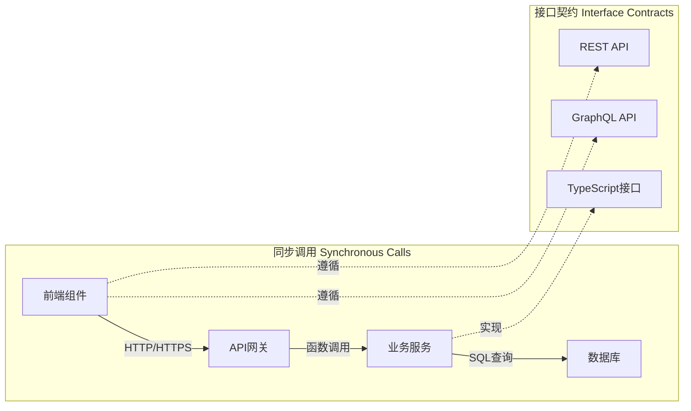

### 5.2 异步通信模式

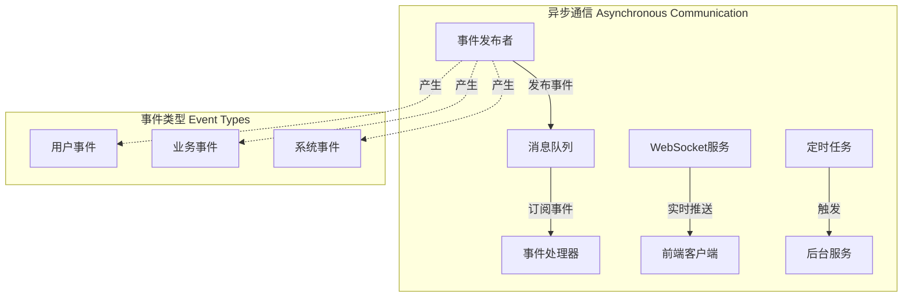

---

## 7. 部署组件视图

### 7.1 跨平台部署架构

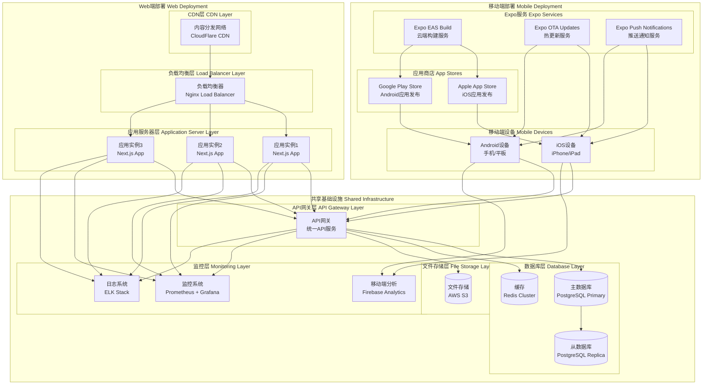

### 7.2 移动端发布流程

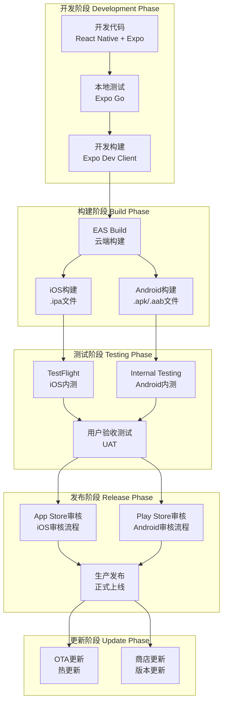

---

## 7. 安全组件

### 7.1 安全架构组件

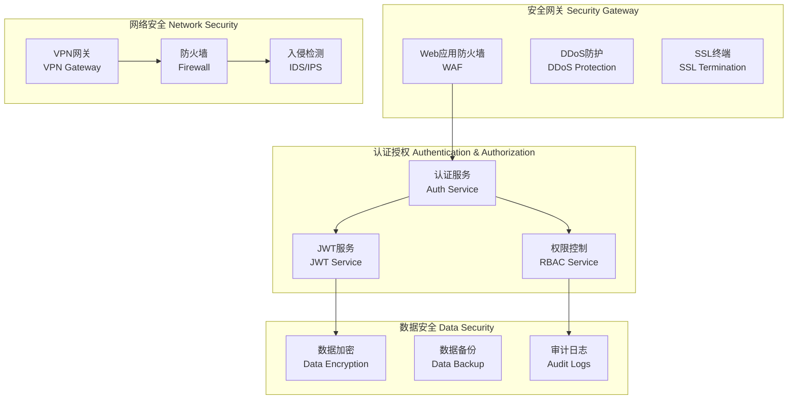

---

**文档版本**: v1.0  
**最后更新**: 2025年7月  
**维护人员**: 赵启睿  
**审核人员**: 赵启睿
