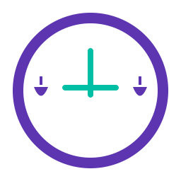

# 律时 (LawTime) ERP系统

<div align="center">



**面向律师行业的智能化ERP系统**

[](LICENSE)
[](package.json)
[](docs/技术架构验证报告.md)
[](https://github.com/lawtime/lawtime-erp)

[功能特性](#功能特性) • [技术架构](#技术架构) • [快速开始](#快速开始) • [文档](#文档) • [贡献指南](#贡献指南)

</div>

## 项目简介

律时ERP系统是一个专为律师事务所设计的综合性数字化管理平台，通过AI驱动的智能化解决方案，帮助律所实现全面的数字化转型。系统采用三端一体化架构，包含Web前台、Web后台和移动端应用，为律师和客户提供高效、专业的法律服务体验。

### 🎯 项目愿景

让法律服务更智能、更高效、更透明

### 🏆 核心价值
- **专业性**: 深度理解法律行业业务流程
- **智能化**: AI驱动的工作流程优化
- **透明化**: 客户可实时了解案件进展
- **高效性**: 显著提升律所工作效率

## 功能特性

### 🏢 律师端功能
- **案件管理**: 全生命周期案件管理，从立案到结案
- **时间记录**: 多种方式记录工时，支持语音转文字
- **文档管理**: 智能文档分类、版本控制、OCR识别
- **AI合同审查**: 智能识别合同风险，自动生成审查报告
- **客户管理**: 完整的客户信息管理和沟通记录
- **项目协作**: 基于飞书日历的项目可视化管理
- **财务管理**: 计费管理、报销审批、收费统计

### 👥 客户端功能
- **项目跟踪**: 实时了解案件进展和时间节点
- **在线沟通**: 与律师团队直接沟通交流
- **文档共享**: 安全的文档查看和下载
- **AI咨询**: 基础法律问题智能解答
- **服务评价**: 对律师服务进行评价反馈

### 🤖 AI驱动功能
- **智能语音**: 语音转文字，智能会议记录
- **文档OCR**: 自动识别和数字化纸质文档
- **合同分析**: 智能识别合同条款和风险点
- **智能填表**: 基于历史数据的表单智能填写
- **法律咨询**: AI法律助手，提供基础法律建议
- **数字人接待**: 智能客服，24小时在线服务

### 📱 三端特色
- **Web前台**: 营销展示、用户注册、基础服务
- **Web后台**: 数据管理、系统配置、高级功能
- **移动端**: 便携操作、实时通知、核心功能

## 技术架构

### ✅ 当前落地（Web 主工程）

本仓库当前**真实可运行/可验收**的 Web 主工程为：`lawclick-next/`（Next.js App Router + Prisma + PostgreSQL）。

```
┌──────────────────────────────────────────┐
│ Web 主工程：lawclick-next/               │
│ Next.js 16 + React 19 + Prisma + TS      │
├──────────────────────────────────────────┤
│ PostgreSQL 15（Docker Compose）          │
│ MinIO（对象存储，Docker Compose）        │
└──────────────────────────────────────────┘
```

> 说明：`apps/web-frontend/` 为历史原型/空壳（包含 mock/TODO），已从 pnpm workspace 中排除，不纳入主线质量门禁（遵循 `.agent/rules/lawclick.md` 的“无空壳/无假数据”）。

### 🏗️ 目标架构（规划，未在本仓库完整落地）
```
┌─────────────────┬─────────────────┬─────────────────┐
│   Web前台       │   Web后台       │   移动端App     │
│   (Next.js)     │   (Next.js)     │   (Flutter)     │
├─────────────────┴─────────────────┴─────────────────┤
│              API网关 (Axum + Tower)                 │
├─────────────────┬─────────────────┬─────────────────┤
│   业务服务      │   AI服务        │  工作流集成     │
│   (Rust)        │   (Rust)        │   (Rust)        │
├─────────────────┼─────────────────┼─────────────────┤
│  PostgreSQL     │     Redis       │  Elasticsearch  │
│   (主数据库)    │    (缓存)       │   (搜索引擎)    │
└─────────────────┴─────────────────┴─────────────────┘
```

### 💻 技术栈

#### Web（已落地：`lawclick-next/`）
- **框架**: Next.js 16.0.6 + React 19.2.0 + TypeScript
- **DB/ORM**: PostgreSQL + Prisma
- **UI**: Radix UI + Tailwind CSS v4 + MDI 浮窗（`react-grid-layout`）
- **E2E**: Playwright

#### 移动端（暂不验收）
- **Flutter/Dart**: `apps/mobile/` 依赖 Flutter 3.16.5 / Dart >= 3.2.3（当前本地环境若不满足会导致 `pub get` 失败）

#### 后端（规划，未在本仓库完整落地）
- **运行时**: Rust 1.75.0 (2021 Edition)
- **Web框架**: Axum 0.7.2 + Tokio 1.35.1
- **数据库**: PostgreSQL 15.5 + Redis 7.2.3
- **ORM**: SeaORM 0.12.10 + SQLx 0.7.3
- **搜索**: Elasticsearch 8.11.3

#### AI技术与工作流集成
- **语言模型**: OpenAI GPT-4 Turbo / Claude 3.5 Sonnet
- **语音识别**: Azure Speech Services 1.34.1
- **文档OCR**: Azure Document Intelligence 4.0.0
- **工作流平台**: n8n 1.19.4 + Cherry Studio (MCP 1.0.2)
- **AI集成**: 统一AI服务抽象层

#### DevOps
- **容器化**: Docker 24.0.7 + Kubernetes 1.28.4 (优化的Rust镜像)
- **CI/CD**: GitHub Actions (Rust工具链)
- **监控**: Prometheus 2.48.1 + Grafana 10.2.3 + Sentry
- **日志**: ELK Stack 8.11.3 + tracing 0.1.40

## 快速开始

### 📋 环境要求（Web 主工程）
- **Node.js**: >= 18.19.0
- **pnpm**: >= 8.12.1
- **Docker**: 可选（用于本地 PostgreSQL/MinIO）

### 🚀 本地开发（Web：`lawclick-next/`）

#### 1. 安装依赖
```bash
pnpm install:web
```

#### 2. 启动依赖服务（可选，推荐）
```bash
cd lawclick-next
docker compose up -d
```

#### 3. 启动开发服务
```bash
pnpm dev
```

默认地址：`http://localhost:3000`

#### 4. 质量门禁（必须全部通过）
```bash
pnpm lint
pnpm type-check
pnpm build
pnpm prisma:validate
pnpm test
```

## 项目结构

```
LawClick_NEW/
├── lawclick-next/          # Web 主工程（生产）
├── apps/
│   ├── mobile/             # Flutter（暂不验收）
│   └── web-frontend/       # 历史原型/空壳（已隔离，不纳入主线）
├── docs/                   # 项目文档（含审计与证据落盘）
├── Prototype/              # 原型资产
├── .agent/                 # 工程规范（lawclick.md）
├── Cargo.toml              # Rust 规划占位（未在本仓库完整落地）
├── package.json            # 根脚本（对齐 lawclick-next，一键全通过）
└── pnpm-workspace.yaml     # pnpm workspace（排除原型/空壳）
```

## 文档

### 📚 项目文档
- [需求说明文档](./docs/需求说明文档.md)
- [技术栈文档](./docs/技术栈文档.md)
- [技术架构验证报告](./docs/技术架构验证报告.md)
- [模块设计文档](./docs/模块设计文档.md)
- [API接口文档](./docs/API接口文档.md)
- [TG12 批判性审计](./docs/TG12_本轮开发批判性检视_2025-12-18.md)

### 🔧 审计证据
- `docs/_artifacts/`：lint/build/typecheck/e2e 等原始输出落盘（可复现）

### 🎨 设计资源
- [原型图](./Prototype/) - 高保真交互原型

## 开发规范

### 📝 代码规范
- **强制规范**：以 `.agent/rules/lawclick.md` 为准（无空壳/无假数据/MDI）
- **Web 主工程**：TypeScript + ESLint + Playwright（`pnpm lint/type-check/build/test` 必须全通过）

### 🧪 测试规范
- **E2E（Web）**：Playwright 覆盖关键主线回归（登录/案件/通知跳转等）

### 🔄 工作流程
1. 变更必须同时满足：Schema/API/落库/回读（避免“看似可用”的空壳）
2. 本地先跑 `pnpm lint/type-check/build/test` 再进入验收

## 贡献指南

我们欢迎所有形式的贡献！请阅读 [贡献指南](CONTRIBUTING.md) 了解如何参与项目开发。

### 🤝 如何贡献
1. Fork 项目仓库
2. 创建功能分支 (`git checkout -b feature/AmazingFeature`)
3. 提交更改 (`git commit -m 'Add some AmazingFeature'`)
4. 推送到分支 (`git push origin feature/AmazingFeature`)
5. 创建 Pull Request

### 🐛 问题反馈
如果您发现了bug或有功能建议，请通过以下方式反馈：
- [GitHub Issues](https://github.com/lawtime/lawtime-erp/issues)
- 邮件: support@lawtime.com
- 微信群: 扫描二维码加入开发者群

## 许可证

本项目采用 MIT 许可证 - 查看 [LICENSE](LICENSE) 文件了解详情。

## 联系我们

- **官网**: https://lawtime.com
- **邮箱**: contact@lawtime.com
- **微信**: LawTimeOfficial
- **QQ群**: 123456789

---

<div align="center">

**⭐ 如果这个项目对您有帮助，请给我们一个Star！**

Made with ❤️ by [律时团队](https://github.com/lawtime)

</div>
