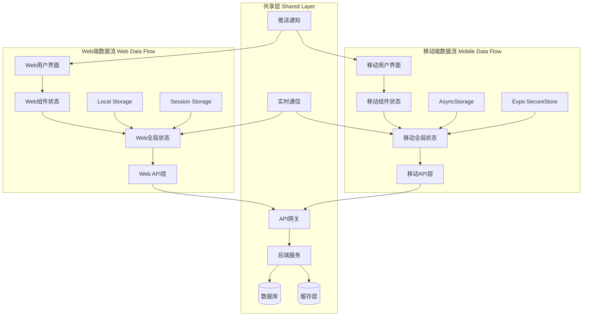

# 数据流设计 (Data Flow Design)

## 概述

本文档详细描述律时(LawClick)跨平台应用的数据流架构，包括Web端(Next.js)和移动端(React Native)的数据获取、状态管理、缓存策略和数据同步机制。

---

## 1. 数据流架构概览

### 1.1 整体架构



### 1.2 数据流向

#### 下行数据流 (Data Down)
```
Database → Backend → API → Cache → Global State → Component State → UI
```

#### 上行数据流 (Data Up)
```
UI → Component State → Global State → API → Backend → Database
```

#### 实时数据流 (Real-time)
```
Database → Backend → WebSocket → Global State → Component State → UI
```

---

## 2. 跨平台状态管理架构

### 2.1 平台状态管理对比

| 特性 | Web端 (Next.js) | 移动端 (React Native) |
|------|-----------------|----------------------|
| 全局状态 | React Context | Redux Toolkit |
| 本地存储 | localStorage | AsyncStorage |
| 安全存储 | 不适用 | Expo SecureStore |
| 会话存储 | sessionStorage | 内存状态 |
| 缓存策略 | 浏览器缓存 | React Query + AsyncStorage |
| 实时同步 | WebSocket | WebSocket + Redux |

### 2.2 Web端状态分层

#### 应用级状态 (Application State)
```typescript
// contexts/AppContext.tsx
interface AppState {
  // 用户认证状态
  auth: {
    user: User | null;
    isAuthenticated: boolean;
    permissions: Permission[];
  };
  
  // 应用配置
  config: {
    theme: 'light' | 'dark';
    language: 'zh' | 'en';
    timezone: string;
  };
  
  // 全局UI状态
  ui: {
    sidebarOpen: boolean;
    loading: boolean;
    notifications: Notification[];
  };
}

const AppContext = createContext<{
  state: AppState;
  dispatch: React.Dispatch<AppAction>;
} | undefined>(undefined);

export const AppProvider: React.FC<{ children: React.ReactNode }> = ({ children }) => {
  const [state, dispatch] = useReducer(appReducer, initialState);
  
  // 持久化状态到localStorage
  useEffect(() => {
    localStorage.setItem('app-state', JSON.stringify(state));
  }, [state]);
  
  return (
    <AppContext.Provider value={{ state, dispatch }}>
      {children}
    </AppContext.Provider>
  );
};
```

#### 业务级状态 (Business State)
```typescript
// contexts/CalendarContext.tsx
interface CalendarState {
  events: CalendarEvent[];
  selectedDate: Date;
  viewMode: 'day' | 'week' | 'month';
  filters: EventFilter[];
  loading: boolean;
  error: string | null;
}

export const CalendarProvider: React.FC<{ children: React.ReactNode }> = ({ children }) => {
  const [state, setState] = useState<CalendarState>(initialCalendarState);
  
  const actions = useMemo(() => ({
    // 获取事件
    fetchEvents: async (dateRange: DateRange) => {
      setState(prev => ({ ...prev, loading: true }));
      try {
        const events = await api.calendar.getEvents(dateRange);
        setState(prev => ({ ...prev, events, loading: false }));
      } catch (error) {
        setState(prev => ({ ...prev, error: error.message, loading: false }));
      }
    },
    
    // 创建事件
    createEvent: async (eventData: CreateEventData) => {
      const newEvent = await api.calendar.createEvent(eventData);
      setState(prev => ({
        ...prev,
        events: [...prev.events, newEvent]
      }));
    },
    
    // 更新事件
    updateEvent: async (eventId: string, updates: Partial<CalendarEvent>) => {
      const updatedEvent = await api.calendar.updateEvent(eventId, updates);
      setState(prev => ({
        ...prev,
        events: prev.events.map(event => 
          event.id === eventId ? updatedEvent : event
        )
      }));
    },
    
    // 删除事件
    deleteEvent: async (eventId: string) => {
      await api.calendar.deleteEvent(eventId);
      setState(prev => ({
        ...prev,
        events: prev.events.filter(event => event.id !== eventId)
      }));
    },
  }), []);
  
  return (
    <CalendarContext.Provider value={{ state, actions }}>
      {children}
    </CalendarContext.Provider>
  );
};
```

### 2.2 状态更新模式

#### 乐观更新 (Optimistic Updates)
```typescript
const useOptimisticUpdate = <T>(
  data: T[],
  updateFn: (id: string, updates: Partial<T>) => Promise<T>
) => {
  const [optimisticData, setOptimisticData] = useState(data);
  
  const update = async (id: string, updates: Partial<T>) => {
    // 立即更新UI
    setOptimisticData(prev => 
      prev.map(item => 
        item.id === id ? { ...item, ...updates } : item
      )
    );
    
    try {
      // 发送API请求
      const updatedItem = await updateFn(id, updates);
      
      // 用服务器响应更新状态
      setOptimisticData(prev => 
        prev.map(item => 
          item.id === id ? updatedItem : item
        )
      );
    } catch (error) {
      // 回滚到原始状态
      setOptimisticData(data);
      throw error;
    }
  };
  
  return { data: optimisticData, update };
};
```

#### 悲观更新 (Pessimistic Updates)
```typescript
const usePessimisticUpdate = <T>(
  data: T[],
  updateFn: (id: string, updates: Partial<T>) => Promise<T>
) => {
  const [loading, setLoading] = useState(false);
  const [error, setError] = useState<string | null>(null);
  
  const update = async (id: string, updates: Partial<T>) => {
    setLoading(true);
    setError(null);
    
    try {
      const updatedItem = await updateFn(id, updates);
      // 只有在成功后才更新UI
      return updatedItem;
    } catch (error) {
      setError(error.message);
      throw error;
    } finally {
      setLoading(false);
    }
  };
  
  return { update, loading, error };
};
```

### 2.4 移动端状态管理 (Redux Toolkit)

#### Redux Store配置
```typescript
// store/index.ts (React Native)
import { configureStore } from '@reduxjs/toolkit';
import { persistStore, persistReducer } from 'redux-persist';
import AsyncStorage from '@react-native-async-storage/async-storage';
import { combineReducers } from '@reduxjs/toolkit';

// Reducers
import authReducer from './slices/authSlice';
import calendarReducer from './slices/calendarSlice';
import casesReducer from './slices/casesSlice';
import timeReducer from './slices/timeSlice';

const persistConfig = {
  key: 'root',
  storage: AsyncStorage,
  whitelist: ['auth', 'calendar'], // 只持久化特定的reducer
};

const rootReducer = combineReducers({
  auth: authReducer,
  calendar: calendarReducer,
  cases: casesReducer,
  time: timeReducer,
});

const persistedReducer = persistReducer(persistConfig, rootReducer);

export const store = configureStore({
  reducer: persistedReducer,
  middleware: (getDefaultMiddleware) =>
    getDefaultMiddleware({
      serializableCheck: {
        ignoredActions: ['persist/PERSIST', 'persist/REHYDRATE'],
      },
    }),
});

export const persistor = persistStore(store);

export type RootState = ReturnType<typeof store.getState>;
export type AppDispatch = typeof store.dispatch;
```

#### 移动端认证状态管理
```typescript
// store/slices/authSlice.ts (React Native)
import { createSlice, createAsyncThunk, PayloadAction } from '@reduxjs/toolkit';
import * as SecureStore from 'expo-secure-store';
import { User } from '../../types';
import { authAPI } from '../../services/api';

interface AuthState {
  user: User | null;
  token: string | null;
  isAuthenticated: boolean;
  loading: boolean;
  error: string | null;
}

const initialState: AuthState = {
  user: null,
  token: null,
  isAuthenticated: false,
  loading: false,
  error: null,
};

// 异步操作
export const login = createAsyncThunk(
  'auth/login',
  async (credentials: { email: string; password: string }) => {
    const response = await authAPI.login(credentials);

    // 安全存储敏感信息
    await SecureStore.setItemAsync('authToken', response.token);
    await SecureStore.setItemAsync('refreshToken', response.refreshToken);

    return response;
  }
);

export const logout = createAsyncThunk(
  'auth/logout',
  async () => {
    // 清除安全存储
    await SecureStore.deleteItemAsync('authToken');
    await SecureStore.deleteItemAsync('refreshToken');

    await authAPI.logout();
  }
);

const authSlice = createSlice({
  name: 'auth',
  initialState,
  reducers: {
    clearError: (state) => {
      state.error = null;
    },
    setToken: (state, action: PayloadAction<string>) => {
      state.token = action.payload;
      state.isAuthenticated = true;
    },
  },
  extraReducers: (builder) => {
    builder
      .addCase(login.pending, (state) => {
        state.loading = true;
        state.error = null;
      })
      .addCase(login.fulfilled, (state, action) => {
        state.loading = false;
        state.user = action.payload.user;
        state.token = action.payload.token;
        state.isAuthenticated = true;
      })
      .addCase(login.rejected, (state, action) => {
        state.loading = false;
        state.error = action.error.message || 'Login failed';
      })
      .addCase(logout.fulfilled, (state) => {
        state.user = null;
        state.token = null;
        state.isAuthenticated = false;
      });
  },
});

export const { clearError, setToken } = authSlice.actions;
export default authSlice.reducer;
```

#### React Native Hooks
```typescript
// hooks/useAppSelector.ts
import { TypedUseSelectorHook, useDispatch, useSelector } from 'react-redux';
import type { RootState, AppDispatch } from '../store';

export const useAppDispatch = () => useDispatch<AppDispatch>();
export const useAppSelector: TypedUseSelectorHook<RootState> = useSelector;

// hooks/useAuth.ts (React Native版本)
import { useAppSelector, useAppDispatch } from './useAppSelector';
import { login, logout, clearError } from '../store/slices/authSlice';

export const useAuth = () => {
  const dispatch = useAppDispatch();
  const { user, token, isAuthenticated, loading, error } = useAppSelector(
    (state) => state.auth
  );

  const handleLogin = async (credentials: { email: string; password: string }) => {
    return dispatch(login(credentials));
  };

  const handleLogout = async () => {
    return dispatch(logout());
  };

  const clearAuthError = () => {
    dispatch(clearError());
  };

  return {
    user,
    token,
    isAuthenticated,
    loading,
    error,
    login: handleLogin,
    logout: handleLogout,
    clearError: clearAuthError,
  };
};
```

---

## 3. API数据管理

### 3.1 API客户端设计

```typescript
// lib/api.ts
class ApiClient {
  private baseURL: string;
  private token: string | null = null;
  
  constructor(baseURL: string) {
    this.baseURL = baseURL;
  }
  
  setToken(token: string) {
    this.token = token;
  }
  
  private async request<T>(
    endpoint: string,
    options: RequestInit = {}
  ): Promise<T> {
    const url = `${this.baseURL}${endpoint}`;
    const headers = {
      'Content-Type': 'application/json',
      ...(this.token && { Authorization: `Bearer ${this.token}` }),
      ...options.headers,
    };
    
    const response = await fetch(url, {
      ...options,
      headers,
    });
    
    if (!response.ok) {
      throw new Error(`API Error: ${response.status} ${response.statusText}`);
    }
    
    return response.json();
  }
  
  // Calendar API
  calendar = {
    getEvents: (params: GetEventsParams) =>
      this.request<CalendarEvent[]>(`/calendar/events?${new URLSearchParams(params)}`),
    
    createEvent: (data: CreateEventData) =>
      this.request<CalendarEvent>('/calendar/events', {
        method: 'POST',
        body: JSON.stringify(data),
      }),
    
    updateEvent: (id: string, data: Partial<CalendarEvent>) =>
      this.request<CalendarEvent>(`/calendar/events/${id}`, {
        method: 'PUT',
        body: JSON.stringify(data),
      }),
    
    deleteEvent: (id: string) =>
      this.request<void>(`/calendar/events/${id}`, {
        method: 'DELETE',
      }),
  };
  
  // Cases API
  cases = {
    getCases: (params: GetCasesParams) =>
      this.request<Case[]>(`/cases?${new URLSearchParams(params)}`),
    
    getCase: (id: string) =>
      this.request<Case>(`/cases/${id}`),
    
    createCase: (data: CreateCaseData) =>
      this.request<Case>('/cases', {
        method: 'POST',
        body: JSON.stringify(data),
      }),
    
    updateCase: (id: string, data: Partial<Case>) =>
      this.request<Case>(`/cases/${id}`, {
        method: 'PUT',
        body: JSON.stringify(data),
      }),
  };
}

export const api = new ApiClient(process.env.NEXT_PUBLIC_API_URL!);
```

### 3.2 数据获取Hooks

```typescript
// hooks/useApi.ts
export const useApiQuery = <T>(
  key: string,
  queryFn: () => Promise<T>,
  options: {
    enabled?: boolean;
    refetchInterval?: number;
    staleTime?: number;
  } = {}
) => {
  const [data, setData] = useState<T | null>(null);
  const [loading, setLoading] = useState(false);
  const [error, setError] = useState<string | null>(null);
  
  const { enabled = true, refetchInterval, staleTime = 5 * 60 * 1000 } = options;
  
  const fetchData = useCallback(async () => {
    if (!enabled) return;
    
    setLoading(true);
    setError(null);
    
    try {
      const result = await queryFn();
      setData(result);
      
      // 缓存数据
      const cacheKey = `api-cache-${key}`;
      localStorage.setItem(cacheKey, JSON.stringify({
        data: result,
        timestamp: Date.now(),
      }));
    } catch (err) {
      setError(err instanceof Error ? err.message : 'Unknown error');
    } finally {
      setLoading(false);
    }
  }, [key, queryFn, enabled]);
  
  useEffect(() => {
    // 检查缓存
    const cacheKey = `api-cache-${key}`;
    const cached = localStorage.getItem(cacheKey);
    
    if (cached) {
      const { data: cachedData, timestamp } = JSON.parse(cached);
      const isStale = Date.now() - timestamp > staleTime;
      
      if (!isStale) {
        setData(cachedData);
        return;
      }
    }
    
    fetchData();
  }, [fetchData, key, staleTime]);
  
  useEffect(() => {
    if (refetchInterval) {
      const interval = setInterval(fetchData, refetchInterval);
      return () => clearInterval(interval);
    }
  }, [fetchData, refetchInterval]);
  
  return {
    data,
    loading,
    error,
    refetch: fetchData,
  };
};

// 使用示例
export const useCalendarEvents = (dateRange: DateRange) => {
  return useApiQuery(
    `calendar-events-${dateRange.start}-${dateRange.end}`,
    () => api.calendar.getEvents(dateRange),
    {
      staleTime: 2 * 60 * 1000, // 2分钟
      refetchInterval: 5 * 60 * 1000, // 5分钟自动刷新
    }
  );
};
```

### 3.3 数据变更Hooks

```typescript
// hooks/useMutation.ts
export const useApiMutation = <TData, TVariables>(
  mutationFn: (variables: TVariables) => Promise<TData>,
  options: {
    onSuccess?: (data: TData, variables: TVariables) => void;
    onError?: (error: Error, variables: TVariables) => void;
    optimisticUpdate?: (variables: TVariables) => void;
  } = {}
) => {
  const [loading, setLoading] = useState(false);
  const [error, setError] = useState<string | null>(null);
  
  const mutate = async (variables: TVariables) => {
    setLoading(true);
    setError(null);
    
    // 乐观更新
    if (options.optimisticUpdate) {
      options.optimisticUpdate(variables);
    }
    
    try {
      const data = await mutationFn(variables);
      options.onSuccess?.(data, variables);
      return data;
    } catch (err) {
      const error = err instanceof Error ? err : new Error('Unknown error');
      setError(error.message);
      options.onError?.(error, variables);
      throw error;
    } finally {
      setLoading(false);
    }
  };
  
  return {
    mutate,
    loading,
    error,
  };
};

// 使用示例
export const useCreateEvent = () => {
  const { state, actions } = useCalendar();
  
  return useApiMutation(
    (eventData: CreateEventData) => api.calendar.createEvent(eventData),
    {
      onSuccess: (newEvent) => {
        actions.addEvent(newEvent);
        // 清除相关缓存
        const cacheKeys = Object.keys(localStorage).filter(key => 
          key.startsWith('api-cache-calendar-events')
        );
        cacheKeys.forEach(key => localStorage.removeItem(key));
      },
      onError: (error) => {
        console.error('Failed to create event:', error);
      },
    }
  );
};
```

---

## 4. 缓存策略

### 4.1 多层缓存架构

```typescript
// lib/cache.ts
interface CacheEntry<T> {
  data: T;
  timestamp: number;
  ttl: number;
}

class CacheManager {
  private memoryCache = new Map<string, CacheEntry<any>>();
  
  // 内存缓存
  setMemory<T>(key: string, data: T, ttl: number = 5 * 60 * 1000) {
    this.memoryCache.set(key, {
      data,
      timestamp: Date.now(),
      ttl,
    });
  }
  
  getMemory<T>(key: string): T | null {
    const entry = this.memoryCache.get(key);
    if (!entry) return null;
    
    const isExpired = Date.now() - entry.timestamp > entry.ttl;
    if (isExpired) {
      this.memoryCache.delete(key);
      return null;
    }
    
    return entry.data;
  }
  
  // 本地存储缓存
  setLocal<T>(key: string, data: T, ttl: number = 30 * 60 * 1000) {
    const entry: CacheEntry<T> = {
      data,
      timestamp: Date.now(),
      ttl,
    };
    localStorage.setItem(`cache-${key}`, JSON.stringify(entry));
  }
  
  getLocal<T>(key: string): T | null {
    try {
      const stored = localStorage.getItem(`cache-${key}`);
      if (!stored) return null;
      
      const entry: CacheEntry<T> = JSON.parse(stored);
      const isExpired = Date.now() - entry.timestamp > entry.ttl;
      
      if (isExpired) {
        localStorage.removeItem(`cache-${key}`);
        return null;
      }
      
      return entry.data;
    } catch {
      return null;
    }
  }
  
  // 智能获取：先检查内存，再检查本地存储
  get<T>(key: string): T | null {
    return this.getMemory<T>(key) || this.getLocal<T>(key);
  }
  
  // 智能设置：同时设置内存和本地存储
  set<T>(key: string, data: T, memoryTtl?: number, localTtl?: number) {
    this.setMemory(key, data, memoryTtl);
    this.setLocal(key, data, localTtl);
  }
  
  // 清除缓存
  clear(pattern?: string) {
    if (pattern) {
      // 清除匹配模式的缓存
      for (const key of this.memoryCache.keys()) {
        if (key.includes(pattern)) {
          this.memoryCache.delete(key);
        }
      }
      
      for (let i = 0; i < localStorage.length; i++) {
        const key = localStorage.key(i);
        if (key?.startsWith('cache-') && key.includes(pattern)) {
          localStorage.removeItem(key);
        }
      }
    } else {
      // 清除所有缓存
      this.memoryCache.clear();
      Object.keys(localStorage)
        .filter(key => key.startsWith('cache-'))
        .forEach(key => localStorage.removeItem(key));
    }
  }
}

export const cache = new CacheManager();
```

### 4.2 缓存失效策略

```typescript
// hooks/useCacheInvalidation.ts
export const useCacheInvalidation = () => {
  const invalidateCache = useCallback((patterns: string[]) => {
    patterns.forEach(pattern => {
      cache.clear(pattern);
    });
  }, []);
  
  const invalidateCalendarCache = useCallback(() => {
    invalidateCache(['calendar-events', 'calendar-stats']);
  }, [invalidateCache]);
  
  const invalidateCaseCache = useCallback((caseId?: string) => {
    if (caseId) {
      invalidateCache([`case-${caseId}`, 'cases-list']);
    } else {
      invalidateCache(['cases']);
    }
  }, [invalidateCache]);
  
  return {
    invalidateCache,
    invalidateCalendarCache,
    invalidateCaseCache,
  };
};
```

---

## 5. 实时数据同步

### 5.1 WebSocket连接管理

```typescript
// lib/websocket.ts
class WebSocketManager {
  private ws: WebSocket | null = null;
  private reconnectAttempts = 0;
  private maxReconnectAttempts = 5;
  private reconnectDelay = 1000;
  private listeners = new Map<string, Set<(data: any) => void>>();
  
  connect(url: string, token: string) {
    this.ws = new WebSocket(`${url}?token=${token}`);
    
    this.ws.onopen = () => {
      console.log('WebSocket connected');
      this.reconnectAttempts = 0;
    };
    
    this.ws.onmessage = (event) => {
      try {
        const message = JSON.parse(event.data);
        this.handleMessage(message);
      } catch (error) {
        console.error('Failed to parse WebSocket message:', error);
      }
    };
    
    this.ws.onclose = () => {
      console.log('WebSocket disconnected');
      this.attemptReconnect(url, token);
    };
    
    this.ws.onerror = (error) => {
      console.error('WebSocket error:', error);
    };
  }
  
  private attemptReconnect(url: string, token: string) {
    if (this.reconnectAttempts < this.maxReconnectAttempts) {
      this.reconnectAttempts++;
      const delay = this.reconnectDelay * Math.pow(2, this.reconnectAttempts - 1);
      
      setTimeout(() => {
        console.log(`Attempting to reconnect (${this.reconnectAttempts}/${this.maxReconnectAttempts})`);
        this.connect(url, token);
      }, delay);
    }
  }
  
  private handleMessage(message: { type: string; data: any }) {
    const listeners = this.listeners.get(message.type);
    if (listeners) {
      listeners.forEach(listener => listener(message.data));
    }
  }
  
  subscribe(eventType: string, listener: (data: any) => void) {
    if (!this.listeners.has(eventType)) {
      this.listeners.set(eventType, new Set());
    }
    this.listeners.get(eventType)!.add(listener);
    
    return () => {
      const listeners = this.listeners.get(eventType);
      if (listeners) {
        listeners.delete(listener);
        if (listeners.size === 0) {
          this.listeners.delete(eventType);
        }
      }
    };
  }
  
  send(message: any) {
    if (this.ws?.readyState === WebSocket.OPEN) {
      this.ws.send(JSON.stringify(message));
    }
  }
  
  disconnect() {
    if (this.ws) {
      this.ws.close();
      this.ws = null;
    }
  }
}

export const wsManager = new WebSocketManager();
```

### 5.2 实时数据Hook

```typescript
// hooks/useRealTimeData.ts
export const useRealTimeData = () => {
  const { state } = useApp();
  const { invalidateCalendarCache, invalidateCaseCache } = useCacheInvalidation();
  
  useEffect(() => {
    if (!state.auth.isAuthenticated) return;
    
    const wsUrl = process.env.NEXT_PUBLIC_WS_URL!;
    wsManager.connect(wsUrl, state.auth.token);
    
    // 订阅日程更新
    const unsubscribeCalendar = wsManager.subscribe('calendar_update', (data) => {
      invalidateCalendarCache();
      // 可以选择性地更新特定事件而不是清除整个缓存
    });
    
    // 订阅案件更新
    const unsubscribeCase = wsManager.subscribe('case_update', (data) => {
      invalidateCaseCache(data.caseId);
    });
    
    // 订阅通知
    const unsubscribeNotification = wsManager.subscribe('notification', (data) => {
      // 显示实时通知
      showNotification(data);
    });
    
    return () => {
      unsubscribeCalendar();
      unsubscribeCase();
      unsubscribeNotification();
      wsManager.disconnect();
    };
  }, [state.auth.isAuthenticated, state.auth.token]);
};
```

---

## 6. 数据同步策略

### 6.1 离线数据管理

```typescript
// lib/offline.ts
class OfflineManager {
  private pendingActions: Array<{
    id: string;
    action: string;
    data: any;
    timestamp: number;
  }> = [];
  
  constructor() {
    this.loadPendingActions();
    window.addEventListener('online', this.syncPendingActions.bind(this));
  }
  
  addPendingAction(action: string, data: any) {
    const pendingAction = {
      id: generateId(),
      action,
      data,
      timestamp: Date.now(),
    };
    
    this.pendingActions.push(pendingAction);
    this.savePendingActions();
  }
  
  private async syncPendingActions() {
    if (!navigator.onLine || this.pendingActions.length === 0) return;
    
    const actionsToSync = [...this.pendingActions];
    this.pendingActions = [];
    this.savePendingActions();
    
    for (const action of actionsToSync) {
      try {
        await this.executeAction(action);
      } catch (error) {
        console.error('Failed to sync action:', action, error);
        // 重新添加失败的操作
        this.pendingActions.push(action);
      }
    }
    
    this.savePendingActions();
  }
  
  private async executeAction(action: any) {
    switch (action.action) {
      case 'create_event':
        await api.calendar.createEvent(action.data);
        break;
      case 'update_event':
        await api.calendar.updateEvent(action.data.id, action.data.updates);
        break;
      case 'delete_event':
        await api.calendar.deleteEvent(action.data.id);
        break;
      // 其他操作...
    }
  }
  
  private loadPendingActions() {
    try {
      const stored = localStorage.getItem('pending-actions');
      if (stored) {
        this.pendingActions = JSON.parse(stored);
      }
    } catch (error) {
      console.error('Failed to load pending actions:', error);
    }
  }
  
  private savePendingActions() {
    try {
      localStorage.setItem('pending-actions', JSON.stringify(this.pendingActions));
    } catch (error) {
      console.error('Failed to save pending actions:', error);
    }
  }
}

export const offlineManager = new OfflineManager();
```

---

**文档版本**: v1.0  
**最后更新**: 2025年7月  
**维护人员**: 赵启睿
**审核人员**: 赵启睿
