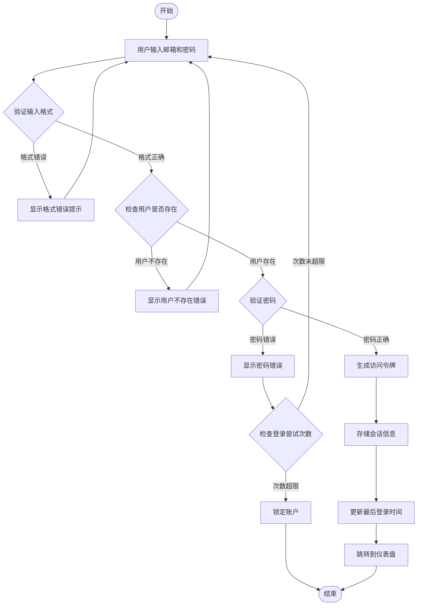
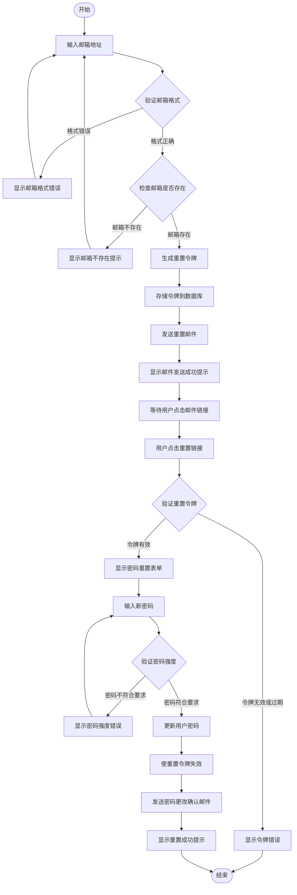
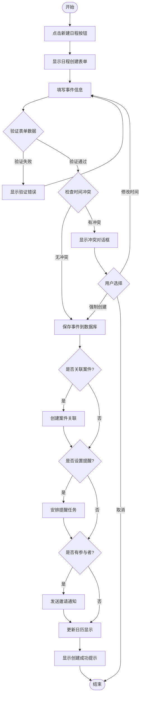
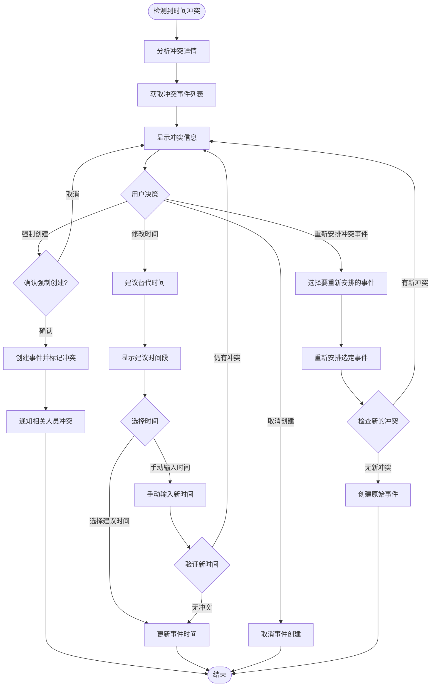
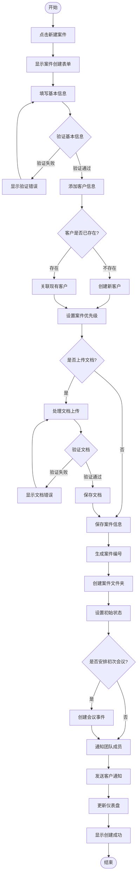
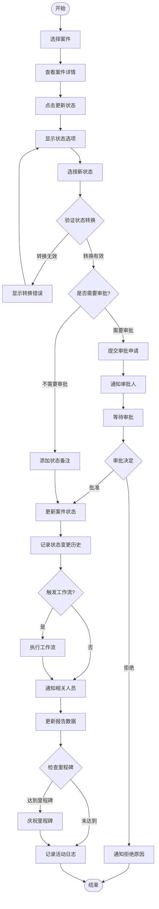
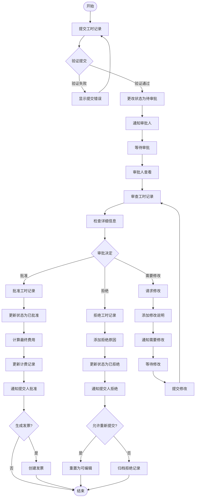
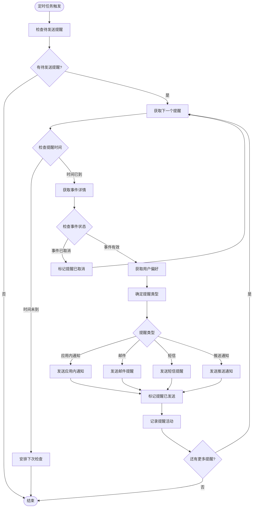
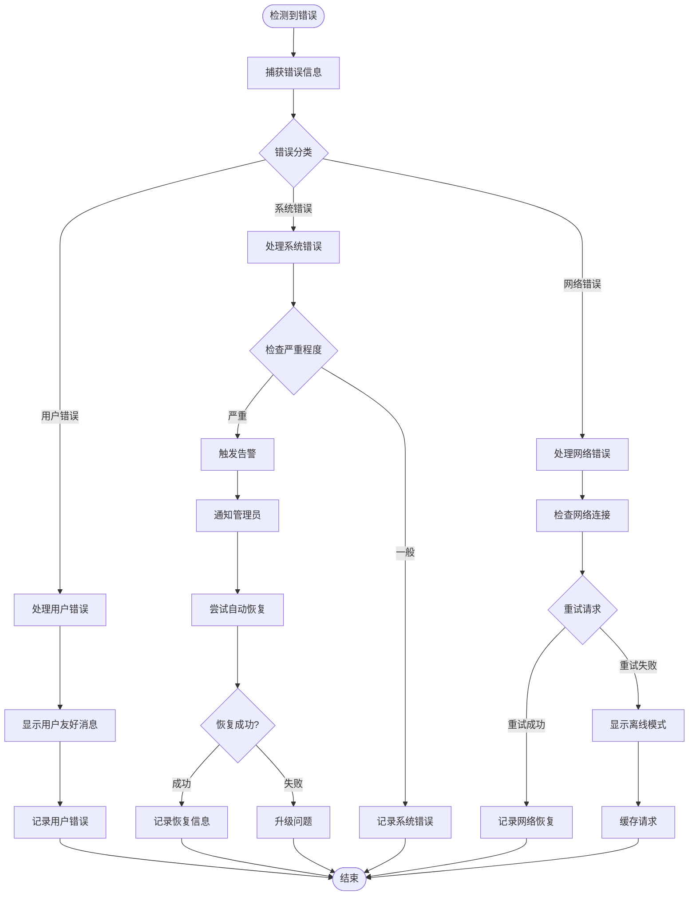

# 活动图 (Activity Diagram)

## 概述

本文档描述律时(LawClick)系统关键业务流程的活动图，展示业务流程的执行步骤、决策点和并行活动。

---

## 1. 用户认证流程

### 1.1 用户登录活动图

### 1.2 密码重置活动图

---

## 2. 日程管理流程

### 2.1 创建日程事件活动图

### 2.2 日程冲突处理活动图

---

## 3. 案件管理流程

### 3.1 案件创建和管理活动图

### 3.2 案件状态更新活动图

---

## 4. 工时记录流程

### 4.1 工时追踪活动图

```mermaid
flowchart TD
    Start([开始]) --> ClickStartWork[点击开始工作]
    ClickStartWork --> SelectCase{选择关联案件?}
    
    SelectCase -->|是| ChooseCase[选择案件]
    SelectCase -->|否| StartTimer[启动计时器]
    ChooseCase --> StartTimer
    
    StartTimer --> RecordStartTime[记录开始时间]
    RecordStartTime --> ShowTimerUI[显示计时器界面]
    ShowTimerUI --> WorkingState[工作状态]
    
    WorkingState --> UserAction{用户操作}
    
    UserAction -->|暂停| PauseTimer[暂停计时器]
    PauseTimer --> RecordPauseTime[记录暂停时间]
    RecordPauseTime --> ShowPausedUI[显示暂停界面]
    ShowPausedUI --> PausedState[暂停状态]
    
    PausedState --> ResumeAction{用户操作}
    ResumeAction -->|继续| ResumeTimer[恢复计时器]
    ResumeAction -->|结束| StopTimer[停止计时器]
    ResumeTimer --> RecordResumeTime[记录恢复时间]
    RecordResumeTime --> WorkingState
    
    UserAction -->|结束| StopTimer
    StopTimer --> RecordEndTime[记录结束时间]
    RecordEndTime --> CalculateDuration[计算总时长]
    CalculateDuration --> ShowSummaryForm[显示工时总结表单]
    
    ShowSummaryForm --> FillDescription[填写工作描述]
    FillDescription --> SetBillableStatus[设置计费状态]
    SetBillableStatus --> ValidateEntry{验证工时记录}
    
    ValidateEntry -->|验证失败| ShowValidationError[显示验证错误]
    ShowValidationError --> FillDescription
    
    ValidateEntry -->|验证通过| SaveTimeEntry[保存工时记录]
    SaveTimeEntry --> CalculateCost{计算费用}
    
    CalculateCost -->|计费时间| ApplyHourlyRate[应用小时费率]
    CalculateCost -->|非计费时间| SkipCostCalculation[跳过费用计算]
    ApplyHourlyRate --> UpdateCaseTotal[更新案件总计]
    SkipCostCalculation --> UpdateCaseTotal
    
    UpdateCaseTotal --> NotifyIfRequired{是否需要通知?}
    NotifyIfRequired -->|是| SendNotification[发送通知]
    NotifyIfRequired -->|否| ShowSuccess[显示保存成功]
    SendNotification --> ShowSuccess
    ShowSuccess --> End([结束])
```

### 4.2 工时审批流程活动图

---

## 5. 通知和提醒流程

### 5.1 事件提醒活动图

---

## 6. 错误处理和恢复流程

### 6.1 系统错误处理活动图

---

**文档版本**: v1.0  
**最后更新**: 2025年7月  
**维护人员**: 赵启睿  
**审核人员**: 赵启睿
