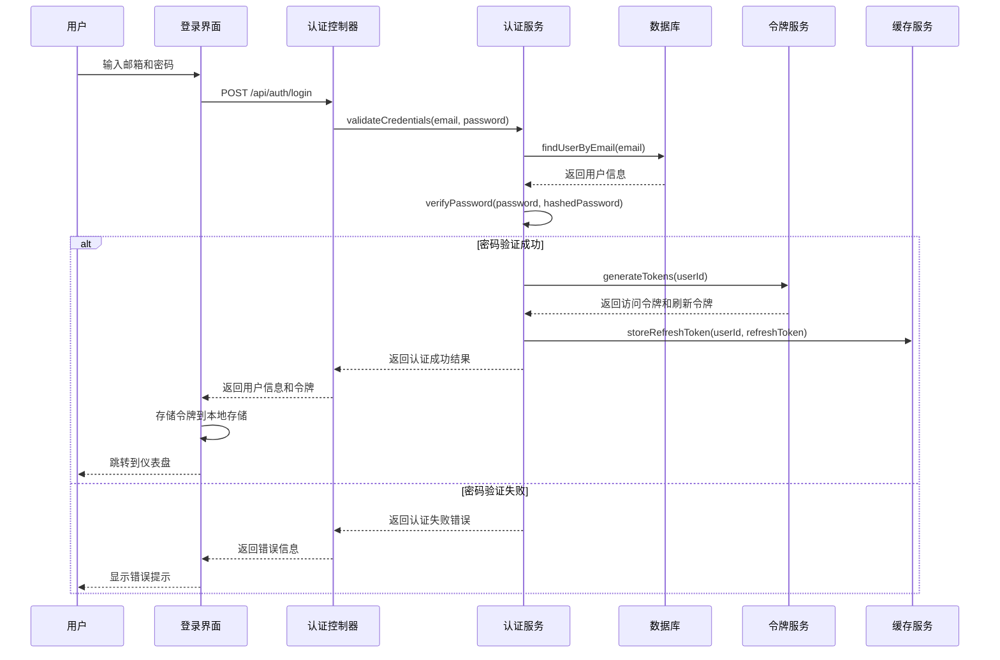
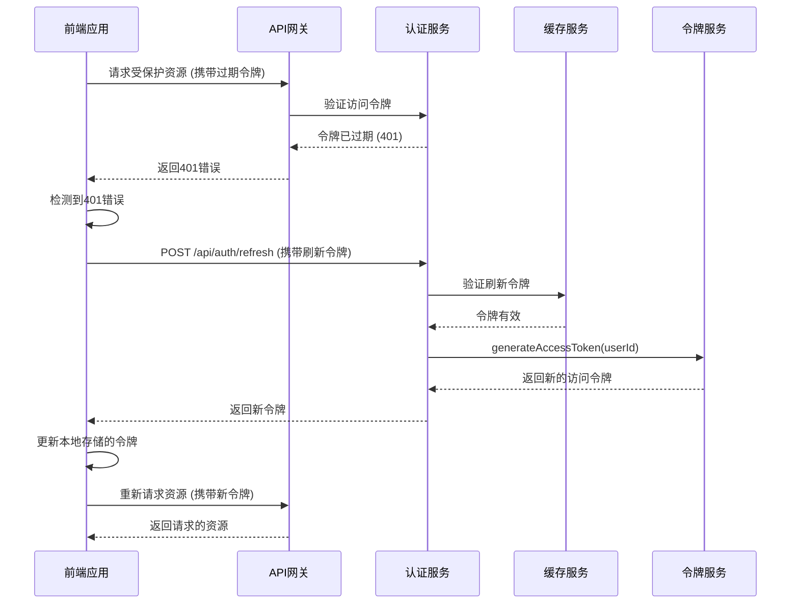
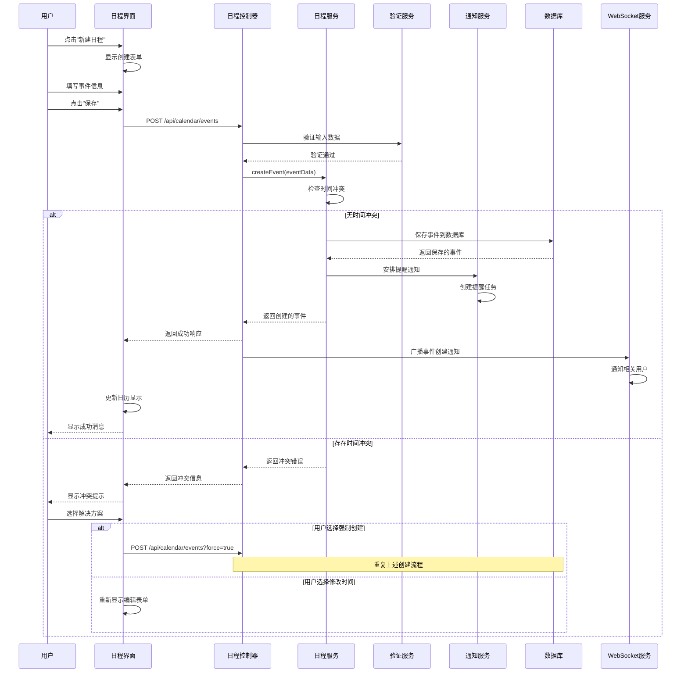
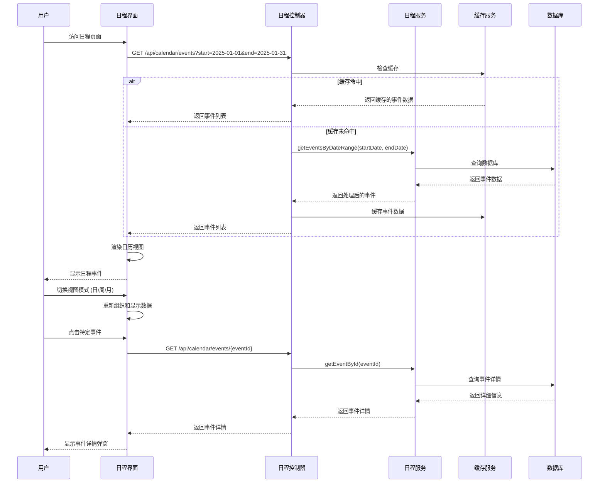
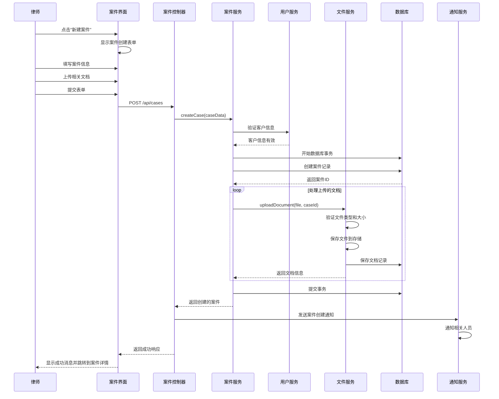
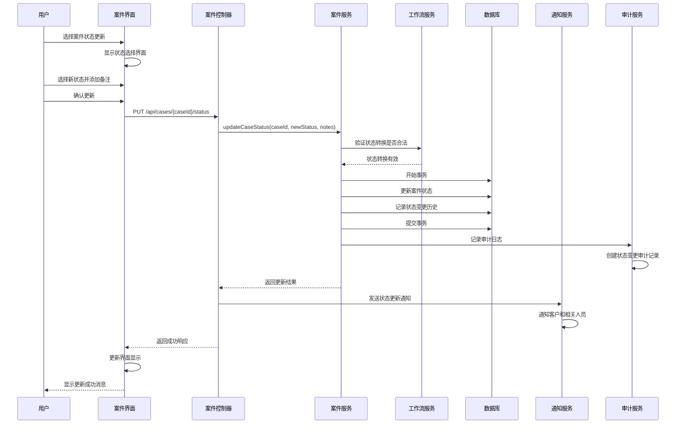
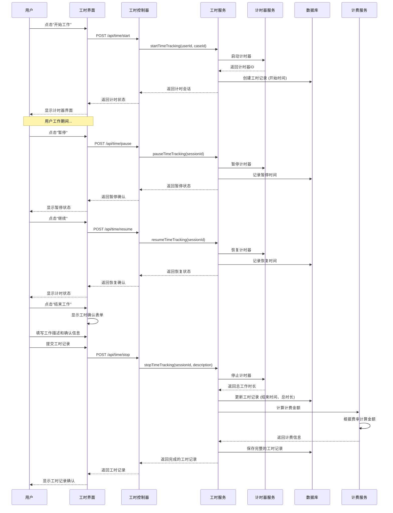
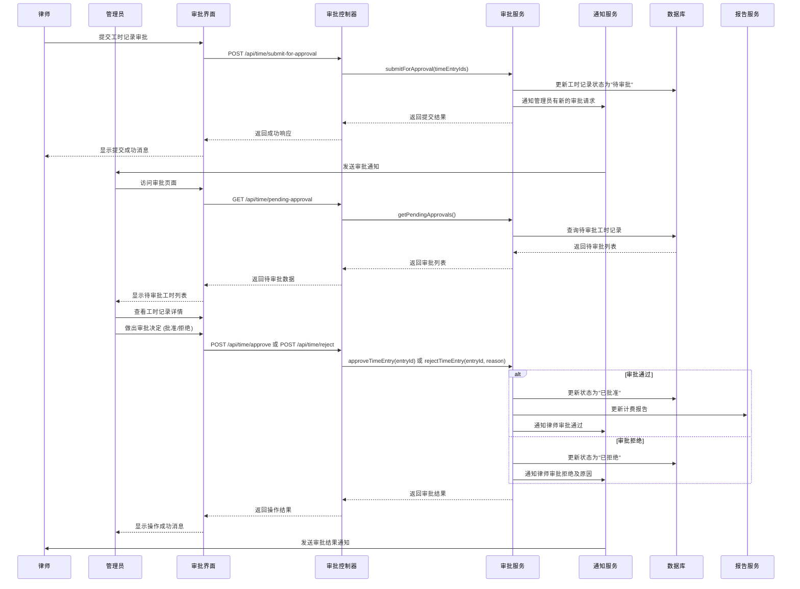
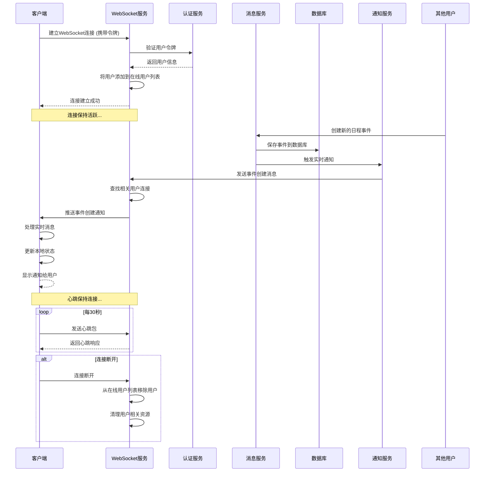
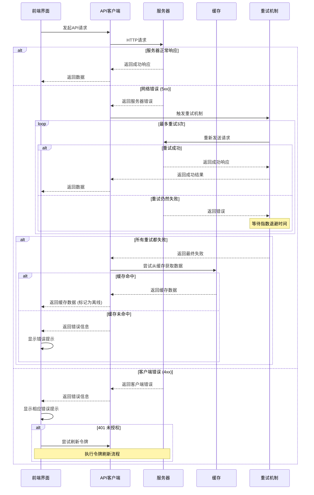

# 时序图 (Sequence Diagram)

## 概述

本文档描述律时(LawClick)系统关键业务流程的时序图，展示各个组件之间的交互顺序和消息传递。

---

## 1. 用户认证流程

### 1.1 用户登录时序图

### 1.2 令牌刷新时序图

---

## 2. 日程管理流程

### 2.1 创建日程事件时序图

### 2.2 查看日程时序图

---

## 3. 案件管理流程

### 3.1 创建案件时序图

### 3.2 案件状态更新时序图

---

## 4. 工时记录流程

### 4.1 工时记录时序图

### 4.2 工时审批时序图

---

## 5. 实时通信流程

### 5.1 WebSocket连接和消息推送时序图 ？？？——留言功能如何实现

---

## 6. 错误处理和重试机制

### 6.1 API请求错误处理时序图

---

**文档版本**: v1.0  
**最后更新**: 2025年7月  
**维护人员**: 赵启睿  
**审核人员**: 赵启睿
