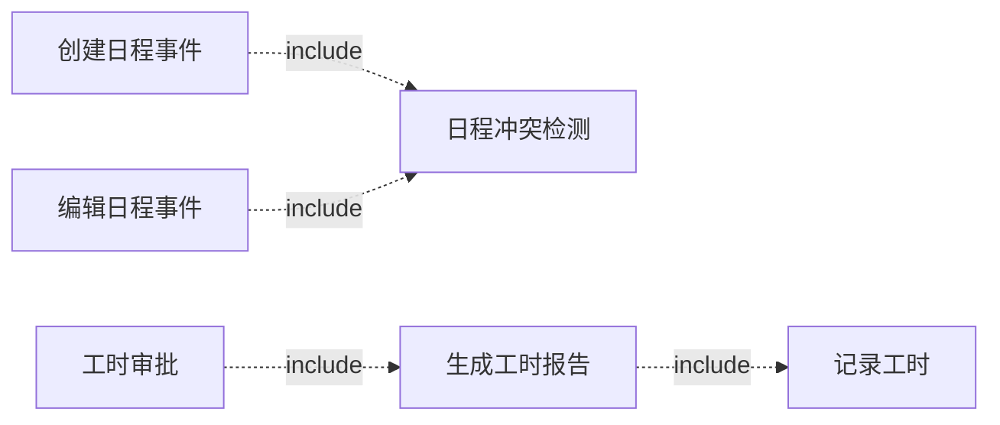
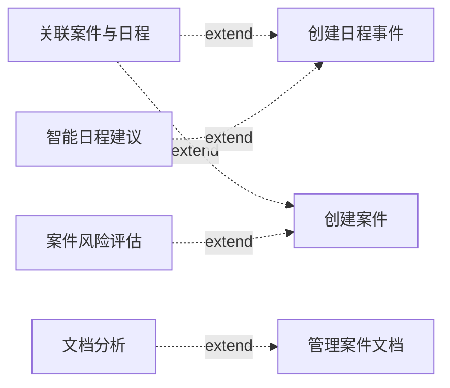
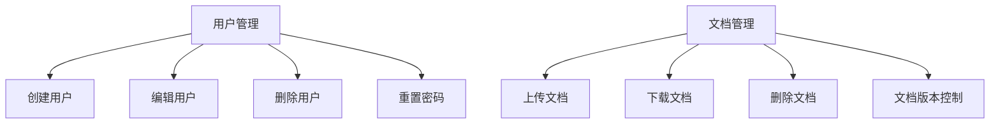

# 用例图 (Use Case Diagram)

## 概述

本文档描述律时(LawClick)系统的用例图，展示不同角色用户与系统的交互关系，以及各种业务场景的用例。

---

## 1. 系统参与者 (Actors)

### 1.1 主要参与者 (Primary Actors)

#### 律师 (Lawyer)
- **描述**: 系统的主要用户，负责案件管理、日程安排、工时记录等核心业务
- **权限**: 完整的业务功能访问权限
- **目标**: 提高工作效率，优化案件管理

#### 法律助理 (Legal Assistant)
- **描述**: 协助律师处理日常事务的用户
- **权限**: 部分业务功能访问权限，主要是协助性功能
- **目标**: 支持律师工作，提高团队协作效率

#### 律所管理员 (Law Firm Administrator)
- **描述**: 负责律所整体运营管理的用户
- **权限**: 系统管理权限，业务数据查看和分析权限
- **目标**: 优化律所运营，提升整体绩效

### 1.2 次要参与者 (Secondary Actors)

#### 客户 (Client)
- **描述**: 律所服务的客户，可能需要查看案件进展
- **权限**: 有限的案件信息查看权限
- **目标**: 了解案件进展，与律师保持沟通

#### 系统管理员 (System Administrator)
- **描述**: 负责系统技术维护的用户
- **权限**: 系统配置和维护权限
- **目标**: 确保系统稳定运行

---

## 2. 核心用例图

### 2.1 整体系统用例图

```mermaid
graph TB
    %% 参与者定义
    Lawyer[律师<br/>Lawyer]
    Assistant[法律助理<br/>Legal Assistant]
    Admin[律所管理员<br/>Administrator]
    Client[客户<br/>Client]
    System[系统管理员<br/>System Admin]
    
    %% 用例定义
    subgraph "律时系统 LawClick System"
        %% 日程管理用例
        subgraph "日程管理 Calendar Management"
            UC1[创建日程事件<br/>Create Calendar Event]
            UC2[查看日程<br/>View Calendar]
            UC3[编辑日程事件<br/>Edit Calendar Event]
            UC4[删除日程事件<br/>Delete Calendar Event]
            UC5[设置提醒<br/>Set Reminders]
            UC6[日程冲突检测<br/>Conflict Detection]
        end
        
        %% 案件管理用例
        subgraph "案件管理 Case Management"
            UC7[创建案件<br/>Create Case]
            UC8[查看案件详情<br/>View Case Details]
            UC9[更新案件状态<br/>Update Case Status]
            UC10[管理案件文档<br/>Manage Case Documents]
            UC11[案件进展跟踪<br/>Track Case Progress]
            UC12[关联案件与日程<br/>Link Case to Calendar]
        end
        
        %% 工时管理用例
        subgraph "工时管理 Time Management"
            UC13[记录工时<br/>Log Time]
            UC14[编辑工时记录<br/>Edit Time Entry]
            UC15[生成工时报告<br/>Generate Time Report]
            UC16[工时审批<br/>Time Approval]
            UC17[计费时间管理<br/>Billable Time Management]
        end
        
        %% 沟通管理用例
        subgraph "沟通管理 Communication"
            UC18[客户沟通记录<br/>Client Communication Log]
            UC19[内部团队协作<br/>Internal Team Collaboration]
            UC20[发送通知<br/>Send Notifications]
            UC21[文件共享<br/>File Sharing]
        end
        
        %% 系统管理用例
        subgraph "系统管理 System Management"
            UC22[用户管理<br/>User Management]
            UC23[权限管理<br/>Permission Management]
            UC24[系统配置<br/>System Configuration]
            UC25[数据备份<br/>Data Backup]
            UC26[生成业务报告<br/>Generate Business Reports]
        end
        
        %% AI助手用例
        subgraph "AI助手 AI Assistant"
            UC27[智能日程建议<br/>Smart Schedule Suggestions]
            UC28[文档分析<br/>Document Analysis]
            UC29[案件风险评估<br/>Case Risk Assessment]
        end
    end
    
    %% 参与者与用例的关系
    %% 律师的用例
    Lawyer --> UC1
    Lawyer --> UC2
    Lawyer --> UC3
    Lawyer --> UC4
    Lawyer --> UC5
    Lawyer --> UC7
    Lawyer --> UC8
    Lawyer --> UC9
    Lawyer --> UC10
    Lawyer --> UC11
    Lawyer --> UC12
    Lawyer --> UC13
    Lawyer --> UC14
    Lawyer --> UC15
    Lawyer --> UC17
    Lawyer --> UC18
    Lawyer --> UC19
    Lawyer --> UC21
    Lawyer --> UC27
    Lawyer --> UC28
    Lawyer --> UC29
    
    %% 法律助理的用例
    Assistant --> UC1
    Assistant --> UC2
    Assistant --> UC3
    Assistant --> UC8
    Assistant --> UC10
    Assistant --> UC11
    Assistant --> UC13
    Assistant --> UC14
    Assistant --> UC18
    Assistant --> UC19
    Assistant --> UC21
    
    %% 管理员的用例
    Admin --> UC2
    Admin --> UC8
    Admin --> UC15
    Admin --> UC16
    Admin --> UC22
    Admin --> UC23
    Admin --> UC26
    
    %% 客户的用例
    Client --> UC8
    Client --> UC11
    
    %% 系统管理员的用例
    System --> UC24
    System --> UC25
    
    %% 用例之间的关系
    UC1 -.->|include| UC6
    UC3 -.->|include| UC6
    UC12 -.->|extend| UC1
    UC12 -.->|extend| UC7
    UC15 -.->|include| UC13
    UC16 -.->|include| UC15
    UC27 -.->|extend| UC1
    UC28 -.->|extend| UC10
    UC29 -.->|extend| UC7
```



---

## 3. 详细用例描述

### 3.1 日程管理用例

#### UC1: 创建日程事件 (Create Calendar Event)

**参与者**: 律师、法律助理  
**前置条件**: 用户已登录系统  
**主要流程**:
1. 用户点击"新建日程"按钮
2. 系统显示日程创建表单
3. 用户填写事件信息（标题、时间、类型、描述等）
4. 用户选择关联案件（可选）
5. 用户设置提醒选项
6. 系统验证输入信息
7. 系统检查时间冲突
8. 系统保存日程事件
9. 系统发送确认通知

**替代流程**:
- 3a. 如果存在时间冲突，系统提示用户确认或修改时间
- 6a. 如果输入信息无效，系统显示错误提示

**后置条件**: 日程事件成功创建并显示在日历中

#### UC2: 查看日程 (View Calendar)

**参与者**: 律师、法律助理、管理员  
**前置条件**: 用户已登录系统  
**主要流程**:
1. 用户访问日程页面
2. 系统显示当前日期的日程视图
3. 用户可以切换日/周/月视图
4. 用户可以导航到不同日期
5. 系统显示对应时间范围的事件
6. 用户可以点击事件查看详情

**扩展流程**:
- 3a. 用户可以筛选特定类型的事件
- 6a. 用户可以直接在日历中编辑事件

### 3.2 案件管理用例

#### UC7: 创建案件 (Create Case)

**参与者**: 律师  
**前置条件**: 用户具有案件创建权限  
**主要流程**:
1. 用户点击"新建案件"按钮
2. 系统显示案件创建表单
3. 用户填写案件基本信息
4. 用户添加客户信息
5. 用户设置案件状态和优先级
6. 系统生成唯一案件编号
7. 系统保存案件信息
8. 系统创建案件文件夹

**后置条件**: 案件成功创建，可以进行后续管理

#### UC8: 查看案件详情 (View Case Details)

**参与者**: 律师、法律助理、管理员、客户  
**前置条件**: 用户具有案件查看权限  
**主要流程**:
1. 用户从案件列表选择案件
2. 系统显示案件详情页面
3. 系统展示案件基本信息
4. 系统显示案件进展时间线
5. 系统列出相关文档和日程
6. 用户可以查看沟通记录

**权限控制**:
- 客户只能查看自己的案件
- 助理可以查看分配给自己的案件
- 律师可以查看所有相关案件

### 3.3 工时管理用例

#### UC13: 记录工时 (Log Time)

**参与者**: 律师、法律助理  
**前置条件**: 用户已登录系统  
**主要流程**:
1. 用户选择工时记录功能
2. 用户选择关联的案件
3. 用户输入工作描述
4. 用户设置开始和结束时间
5. 用户标记是否为计费时间
6. 系统计算工时时长
7. 系统保存工时记录

**替代流程**:
- 4a. 用户可以使用计时器实时记录
- 5a. 系统可以根据事件类型自动判断计费属性

---

## 4. 用例关系

### 4.1 包含关系 (Include)



### 4.2 扩展关系 (Extend)



### 4.3 泛化关系 (Generalization)



---

## 5. 用例优先级

### 5.1 高优先级用例 (P0)
- UC1: 创建日程事件
- UC2: 查看日程
- UC7: 创建案件
- UC8: 查看案件详情
- UC13: 记录工时
- UC22: 用户管理

### 5.2 中优先级用例 (P1)
- UC3: 编辑日程事件
- UC9: 更新案件状态
- UC15: 生成工时报告
- UC18: 客户沟通记录
- UC23: 权限管理

### 5.3 低优先级用例 (P2)
- UC6: 日程冲突检测
- UC16: 工时审批
- UC21: 文件共享
- UC26: 生成业务报告

### 5.4 未来版本用例 (P3)
- UC27: 智能日程建议
- UC28: 文档分析
- UC29: 案件风险评估

---

## 6. 用例实现映射

### 6.1 MVP阶段实现
```
UC1, UC2 → /calendar/new, /calendar
UC7, UC8 → /cases/new, /cases/[id]
UC13 → /time-log/new
UC22 → /admin/users
```

### 6.2 V1.1阶段实现
```
UC3, UC4 → /calendar/event/[id]/edit
UC9, UC10 → /cases/[id]/edit
UC15 → /time-log/reports
UC18 → /communication/clients
```

### 6.3 V2.0阶段实现
```
UC27, UC28, UC29 → /ai-assistant
UC26 → /admin/reports
UC24, UC25 → /admin/system
```

---

**文档版本**: v1.0  
**最后更新**: 2025年7月  
**维护人员**: 赵启睿  
**审核人员**: 赵启睿
