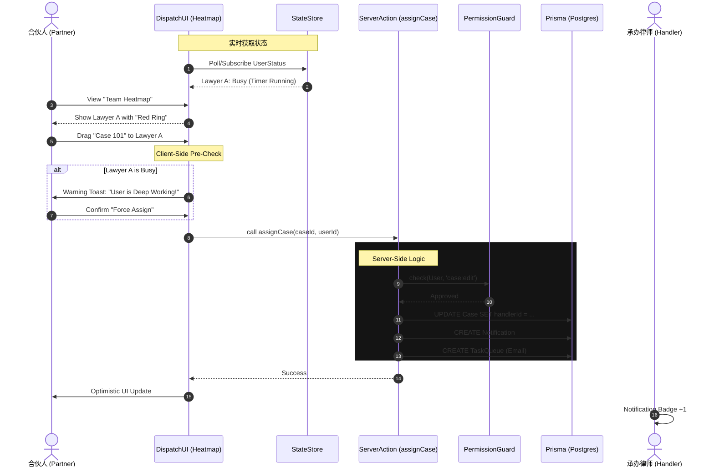

# 业务流程图 (Business Process Diagram)

**版本**: V9.0
**描述**: 智能派单与任务分配的业务流转逻辑。

## 智能派单流程 (Smart Dispatch Process)

```mermaid
sequenceDiagram
    autonumber
    actor Partner as 合伙人 (Partner)
    participant UI as DispatchUI (Heatmap)
    participant Store as StateStore
    participant Server as ServerAction (assignCase)
    participant RBAC as PermissionGuard
    participant DB as Prisma (Postgres)
    actor Lawyer as 承办律师 (Handler)

    Note over UI,Store: 实时获取状态
    UI->>Store: Poll/Subscribe UserStatus
    Store-->>UI: Lawyer A: Busy (Timer Running)
    
    Partner->>UI: View "Team Heatmap"
    UI-->>Partner: Show Lawyer A with "Red Ring"
    
    Partner->>UI: Drag "Case 101" to Lawyer A
    
    Note over UI: Client-Side Pre-Check
    alt Lawyer A is Busy
        UI->>Partner: Warning Toast: "User is Deep Working!"
        Partner->>UI: Confirm "Force Assign"
    end
    
    UI->>Server: call assignCase(caseId, userId)
    
    rect rgb(20, 20, 20)
        Note over Server: Server-Side Logic
        Server->>RBAC: check(User, 'case:edit')
        RBAC-->>Server: Approved
        Server->>DB: UPDATE Case SET handlerId = ...
        Server->>DB: CREATE Notification
        Server->>DB: CREATE TaskQueue (Email)
    end
    
    Server-->>UI: Success
    UI->>Partner: Optimistic UI Update
    
    Lawyer->>Lawyer: Notification Badge +1
```
