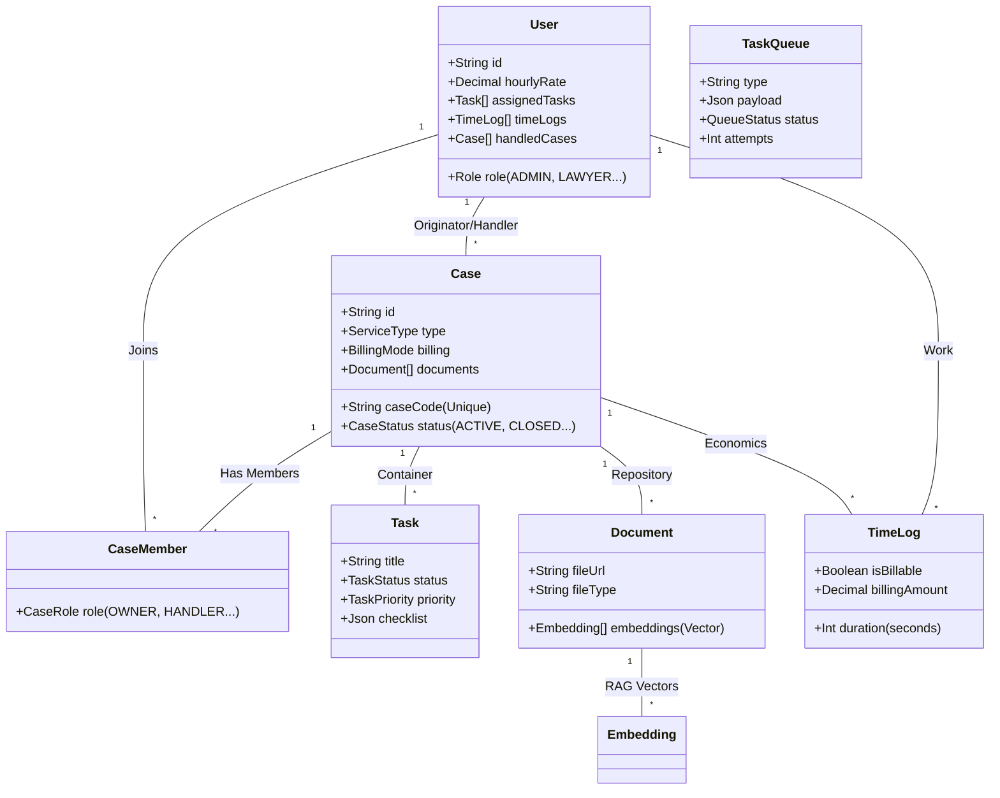

# 数据库类图 (Database Class Diagram)

**版本**: V9.0
**描述**: 基于 `Prisma Schema` 的实体关系图 (ERD)。

```mermaid
classDiagram
    class User {
        +String id
        +Role role (ADMIN, LAWYER...)
        +Decimal hourlyRate
        +Task[] assignedTasks
        +TimeLog[] timeLogs
        +Case[] handledCases
    }

    class Case {
        +String id
        +String caseCode (Unique)
        +CaseStatus status (ACTIVE, CLOSED...)
        +ServiceType type
        +BillingMode billing
        +Document[] documents
    }

    class CaseMember {
        +CaseRole role (OWNER, HANDLER...)
    }

    class Task {
        +String title
        +TaskStatus status
        +TaskPriority priority
        +Json checklist
    }

    class Document {
        +String fileUrl
        +String fileType
        +Embedding[] embeddings (Vector)
    }

    class TimeLog {
        +Int duration (seconds)
        +Boolean isBillable
        +Decimal billingAmount
    }
    
    class TaskQueue {
        +String type
        +Json payload
        +QueueStatus status
        +Int attempts
    }

    User "1" -- "*" Case : Originator/Handler
    User "1" -- "*" CaseMember : Joins
    Case "1" -- "*" CaseMember : Has Members
    Case "1" -- "*" Task : Container
    Case "1" -- "*" Document : Repository
    Case "1" -- "*" TimeLog : Economics
    
    Document "1" -- "*" Embedding : RAG Vectors
    
    User "1" -- "*" TimeLog : Work
```
