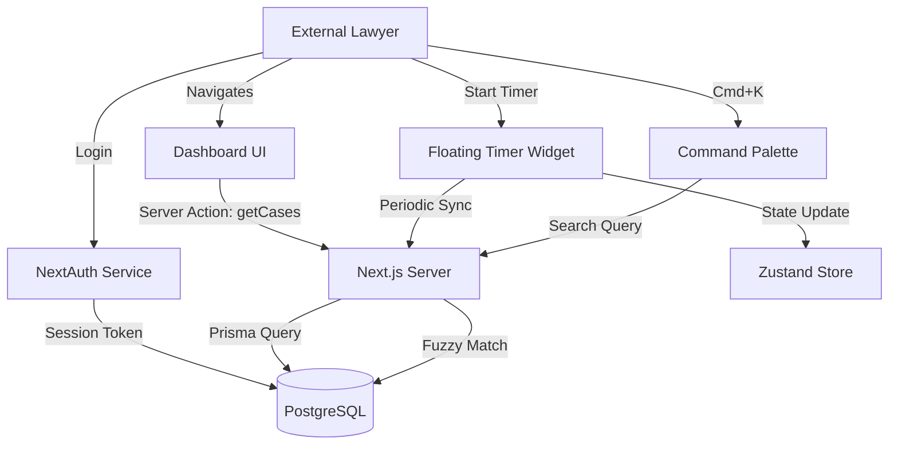

# 数据流图 (Data Flow Diagram)

**版本**: V9.0
**描述**: 智能起草（Smart Drafting）与知识引擎的数据流向。

## 智能起草数据流 (Smart Drafting Data Flow)

```mermaid
flowchart TD
    subgraph "Client Side (Case Detail)"
        Button[Click 'Smart Draft'] --> Dialog[NewDraftDialog]
        Dialog --> Select[Select Template (Registry)]
        Select --> Form[Dynamic Form (Client/Fee/Title)]
        Form --> JSON[Construct JSON Payload]
        JSON --> Action[Call generateDocument()]
    end

    subgraph "Server Side (Actions)"
        Action --> Auth[Validate Session]
        Auth --> Engine[Template Engine (Regex/Replace)]
        
        subgraph "Template Registry"
            T1[Engagement Letter]
            T2[NDA Agreement]
            T3[Court Motion]
        end
        
        Engine -- Load --> T1
        Engine -- Inject Data --> Compiled[Compiled Markdown/PDF]
        
        Compiled --> Storage[Mock File Storage]
        Storage --> DBRecord[Prisma: Document.create]
        
        DBRecord --> Reval[revalidatePath('/cases/[id]')]
    end

    Reval --> ClientRefresh[Client Router Refresh]
    ClientRefresh --> NewDoc[Document Appears in List]
```

## 核心数据流 (Core Data Flow)


