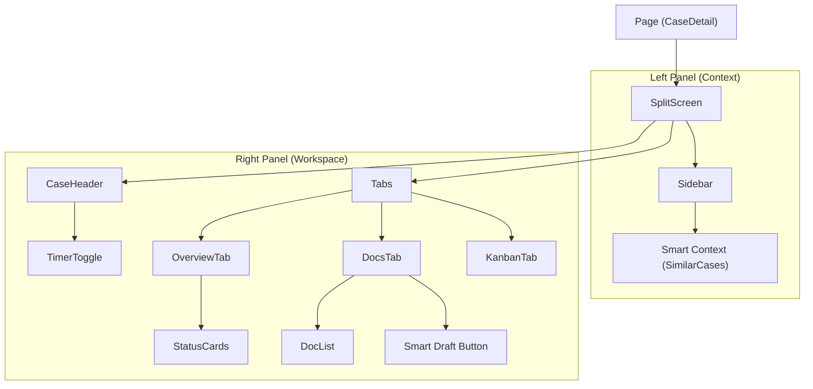

# 组件图 (Component Diagram)

**版本**: V9.0
**描述**: React 前端组件层级与 "浮动生态" 架构图。

## 浮动生态架构 (Floating Ecosystem Architecture)

```mermaid
graph TB
    subgraph "Browser Window (DOM)"
        
        subgraph "Layer 0: Root Contexts"
            Root[RootLayout] --> Session[SessionProvider]
            Session --> Tooltip[TooltipProvider]
            Tooltip --> Body[body]
        end

        subgraph "Layer 1: Main Document Flow (z-index: 0)"
            Body --> DBLayout[DashboardLayout]
            DBLayout --> Sidebar[AppSidebar]
            DBLayout --> Header[AppHeader]
            DBLayout --> PageContent[Page Container]
            
            Header --> CmdK[CommandPalette (Dialog)]
            
            PageContent --> CasePage[CaseDetailPage]
            PageContent --> DispatchPage[DispatchPage]
        end

        subgraph "Layer 2: The Floating Plane (z-index: 50+)"
            Body --> PortalRoot[div#floating-root]
            PortalRoot -- React Portal --> FloatingLayer
            
            FloatingLayer --> Store{FloatingStore (Zustand)}
            
            FloatingLayer --> Frame1[FloatingWindowFrame (Chat)]
            Frame1 --> ChatFeatures[ChatInterface]
            
            FloatingLayer --> Frame2[FloatingWindowFrame (Timer)]
            Frame2 --> TimerFeatures[TimerContent]
        end
    end

    classDef portal fill:#f9f,stroke:#333,stroke-dasharray: 5 5;
    class PortalRoot,FloatingLayer portal;
```

## 案件详情页组件 (Case Detail Components)


