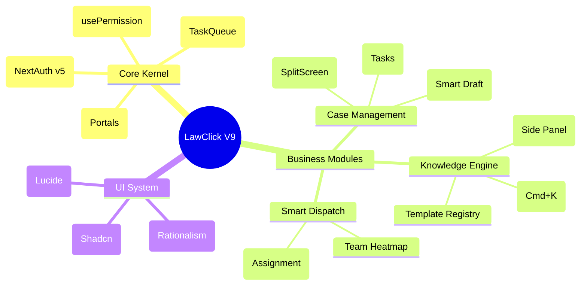

# 项目功能图 (Project Feature Map)

**版本**: V9.0
**描述**: 项目核心功能模块思维导图。

```mermaid
mindmap
  root((LawClick V9))
    Core Kernel
      Auth (NextAuth v5)
      RBAC System (usePermission)
      Async Queue (TaskQueue)
      Floating Layer (Portals)
    Business Modules
      Case Management
        Detail View (SplitScreen)
        Docs Tab (Smart Draft)
        Kanban Tab (Tasks)
      Smart Dispatch
        Team Heatmap
        Logic (Assignment)
      Knowledge Engine
        Similar Cases (Side Panel)
        Global Search (Cmd+K)
        Template Registry
    UI System
      Design (Rationalism)
      Components (Shadcn)
      Icons (Lucide)
```
