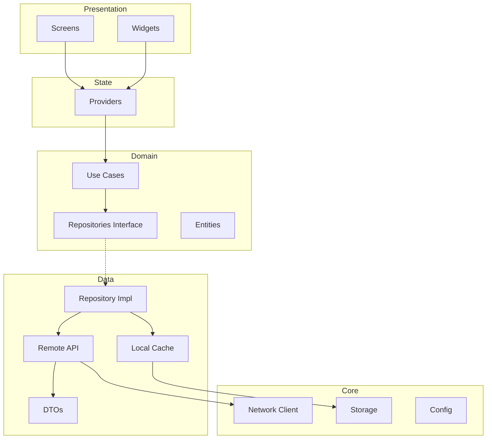

# 律时移动端 - 技术架构设计

> **版本**: 1.0  
> **创建日期**: 2026-01-01  
> **依据**: `docs/技术栈文档.md` + `docs/模块设计文档.md`

---

## 一、整体架构

### 1.1 分层架构图

```
┌─────────────────────────────────────────────────────────────────┐
│                       表现层 (Presentation)                       │
│  ┌─────────────┐  ┌─────────────┐  ┌─────────────────────────┐  │
│  │   Screens   │  │   Widgets   │  │    Shared Components    │  │
│  │   (页面)    │  │   (组件)    │  │     (通用UI组件)        │  │
│  └─────────────┘  └─────────────┘  └─────────────────────────┘  │
├─────────────────────────────────────────────────────────────────┤
│                       状态层 (State Management)                   │
│  ┌─────────────────────────────────────────────────────────────┐│
│  │                    Riverpod Providers                       ││
│  │  (StateNotifier / AsyncNotifier / FutureProvider)          ││
│  └─────────────────────────────────────────────────────────────┘│
├─────────────────────────────────────────────────────────────────┤
│                       业务层 (Domain/Business)                    │
│  ┌─────────────┐  ┌─────────────┐  ┌─────────────────────────┐  │
│  │  Use Cases  │  │   Models    │  │      Repositories       │  │
│  │  (业务逻辑) │  │ (数据模型)  │  │    (仓储接口)           │  │
│  └─────────────┘  └─────────────┘  └─────────────────────────┘  │
├─────────────────────────────────────────────────────────────────┤
│                       数据层 (Data)                               │
│  ┌─────────────┐  ┌─────────────┐  ┌─────────────────────────┐  │
│  │ Remote API  │  │ Local Cache │  │    Data Mappers         │  │
│  │ (Dio/REST)  │  │ (Hive)      │  │    (DTO ↔ Entity)       │  │
│  └─────────────┘  └─────────────┘  └─────────────────────────┘  │
├─────────────────────────────────────────────────────────────────┤
│                       基础层 (Core/Infrastructure)                │
│  ┌──────┐  ┌────────┐  ┌───────┐  ┌────────┐  ┌─────────────┐  │
│  │ HTTP │  │ Secure │  │ Logger│  │ Config │  │  Platform   │  │
│  │Client│  │Storage │  │       │  │        │  │  Channels   │  │
│  └──────┘  └────────┘  └───────┘  └────────┘  └─────────────┘  │
└─────────────────────────────────────────────────────────────────┘
```

### 1.2 架构原则

| 原则 | 描述 | 实践 |
|------|------|------|
| **Clean Architecture** | 依赖反转，内层不依赖外层 | Repository 接口在 Domain 层定义 |
| **Feature-First** | 按功能模块组织代码 | `lib/features/cases/`, `lib/features/tasks/` |
| **单一数据源** | 数据流动单向、可预测 | Riverpod + Repository 模式 |
| **可测试性** | 每层可独立单元测试 | 依赖注入 + Mock |

---

## 二、项目目录结构

```
lawclick_mobile/
├── android/                          # Android 原生代码
├── ios/                              # iOS 原生代码
├── lib/
│   ├── main.dart                     # 应用入口
│   ├── app.dart                      # App 根组件
│   │
│   ├── core/                         # 核心基础设施
│   │   ├── config/
│   │   │   ├── app_config.dart       # 环境配置
│   │   │   ├── theme_config.dart     # 主题配置（LegalMind设计语言）
│   │   │   └── api_config.dart       # API 配置
│   │   ├── network/
│   │   │   ├── dio_client.dart       # Dio HTTP 客户端
│   │   │   ├── api_interceptor.dart  # 请求拦截器（Token、日志）
│   │   │   └── api_exception.dart    # 统一异常处理
│   │   ├── storage/
│   │   │   ├── secure_storage.dart   # 敏感数据存储（Token）
│   │   │   ├── hive_storage.dart     # 本地缓存
│   │   │   └── preferences.dart      # 用户偏好
│   │   ├── router/
│   │   │   ├── app_router.dart       # 路由定义（Go Router）
│   │   │   └── route_guards.dart     # 路由守卫（认证检查）
│   │   ├── utils/
│   │   │   ├── date_utils.dart       # 日期工具
│   │   │   ├── validation.dart       # 输入校验
│   │   │   └── logger.dart           # 日志工具
│   │   └── di/
│   │       └── providers.dart        # 全局 Riverpod Provider
│   │
│   ├── shared/                       # 共享组件/模型
│   │   ├── widgets/
│   │   │   ├── buttons/              # 按钮组件
│   │   │   ├── inputs/               # 输入组件
│   │   │   ├── cards/                # 卡片组件
│   │   │   ├── dialogs/              # 对话框
│   │   │   └── loading/              # 加载态
│   │   ├── models/
│   │   │   ├── user.dart             # 用户模型
│   │   │   ├── pagination.dart       # 分页模型
│   │   │   └── api_response.dart     # 统一响应模型
│   │   └── extensions/               # Dart 扩展方法
│   │
│   ├── features/                     # 功能模块（按业务划分）
│   │   ├── auth/                     # 认证模块
│   │   │   ├── data/
│   │   │   │   ├── auth_api.dart
│   │   │   │   └── auth_repository_impl.dart
│   │   │   ├── domain/
│   │   │   │   ├── models/
│   │   │   │   ├── repositories/
│   │   │   │   └── use_cases/
│   │   │   └── presentation/
│   │   │       ├── screens/
│   │   │       ├── widgets/
│   │   │       └── providers/
│   │   │
│   │   ├── cases/                    # 案件管理
│   │   │   ├── data/
│   │   │   ├── domain/
│   │   │   └── presentation/
│   │   │
│   │   ├── tasks/                    # 任务看板
│   │   │   ├── data/
│   │   │   ├── domain/
│   │   │   └── presentation/
│   │   │
│   │   ├── timelogs/                 # 工时记录
│   │   │   ├── data/
│   │   │   ├── domain/
│   │   │   └── presentation/
│   │   │
│   │   ├── calendar/                 # 日程日历
│   │   │   ├── data/
│   │   │   ├── domain/
│   │   │   └── presentation/
│   │   │
│   │   ├── documents/                # 文档中心
│   │   │   ├── data/
│   │   │   ├── domain/
│   │   │   └── presentation/
│   │   │
│   │   ├── chat/                     # 团队沟通
│   │   │   ├── data/
│   │   │   ├── domain/
│   │   │   └── presentation/
│   │   │
│   │   ├── notifications/            # 通知中心
│   │   │   ├── data/
│   │   │   ├── domain/
│   │   │   └── presentation/
│   │   │
│   │   └── settings/                 # 设置
│   │       ├── data/
│   │       ├── domain/
│   │       └── presentation/
│   │
│   └── l10n/                         # 国际化
│       ├── app_zh.arb
│       └── app_en.arb
│
├── test/                             # 单元测试 & Widget 测试
├── integration_test/                 # 集成测试
├── assets/                           # 静态资源
│   ├── images/
│   ├── icons/
│   └── fonts/
├── pubspec.yaml                      # 依赖配置
└── analysis_options.yaml             # Lint 规则
```

---

## 三、核心依赖清单

### 3.1 状态管理与架构

```yaml
dependencies:
  # 状态管理
  flutter_riverpod: ^2.4.9
  riverpod_annotation: ^2.3.3
  
  # 路由
  go_router: ^12.1.3
  
  # 依赖注入（补充）
  get_it: ^7.6.4
```

### 3.2 网络与数据

```yaml
dependencies:
  # HTTP 客户端
  dio: ^5.4.0
  retrofit: ^4.0.3
  retrofit_generator: ^8.0.6  # dev_dependencies
  
  # JSON 序列化
  json_annotation: ^4.8.1
  json_serializable: ^6.7.1   # dev_dependencies
  
  # 本地存储
  hive: ^2.2.3
  hive_flutter: ^1.1.0
  shared_preferences: ^2.2.2
  flutter_secure_storage: ^9.0.0
```

### 3.3 UI 组件

```yaml
dependencies:
  # 图表
  fl_chart: ^0.66.0
  
  # 日期时间
  intl: ^0.18.1
  table_calendar: ^3.0.9
  
  # 图标
  flutter_svg: ^2.0.9
  lucide_icons: ^0.0.1
  
  # 动画
  flutter_animate: ^4.3.0
  animations: ^2.0.8
```

### 3.4 原生能力

```yaml
dependencies:
  # 语音
  speech_to_text: ^6.6.0
  
  # 文件
  file_picker: ^6.1.1
  open_file: ^3.3.2
  
  # 推送
  firebase_messaging: ^14.7.10
  firebase_core: ^2.24.2
  
  # 生物识别
  local_auth: ^2.1.7
  
  # 相机
  camera: ^0.10.5+9
  image_picker: ^1.0.4
  
  # 权限
  permission_handler: ^11.1.0
  
  # 设备信息
  device_info_plus: ^9.1.1
  package_info_plus: ^5.0.1
```

### 3.5 开发工具

```yaml
dev_dependencies:
  # 代码生成
  build_runner: ^2.4.7
  freezed: ^2.4.5
  freezed_annotation: ^2.4.1
  
  # 测试
  flutter_test:
    sdk: flutter
  mockito: ^5.4.4
  mocktail: ^1.0.1
  
  # Lint
  flutter_lints: ^3.0.1
```

---

## 四、模块间依赖关系



---

## 五、关键实现示例

### 5.1 Dio 客户端配置

```dart
// lib/core/network/dio_client.dart
import 'package:dio/dio.dart';

class DioClient {
  final Dio _dio;
  
  DioClient({required String baseUrl, required String? token}) 
    : _dio = Dio(BaseOptions(
        baseUrl: baseUrl,
        connectTimeout: const Duration(seconds: 30),
        receiveTimeout: const Duration(seconds: 30),
        headers: {
          'Content-Type': 'application/json',
          'Accept': 'application/json',
          if (token != null) 'Authorization': 'Bearer $token',
        },
      )) {
    _dio.interceptors.addAll([
      LogInterceptor(requestBody: true, responseBody: true),
      _AuthInterceptor(),
      _ErrorInterceptor(),
    ]);
  }
  
  Future<Response<T>> get<T>(String path, {Map<String, dynamic>? params}) =>
    _dio.get<T>(path, queryParameters: params);
    
  Future<Response<T>> post<T>(String path, {dynamic data}) =>
    _dio.post<T>(path, data: data);
    
  // ... put, delete, patch
}
```

### 5.2 Repository 模式

```dart
// lib/features/cases/domain/repositories/case_repository.dart
abstract class CaseRepository {
  Future<List<Case>> getCases({int page = 1, int limit = 20});
  Future<Case> getCaseById(String id);
  Future<Case> createCase(CreateCaseRequest request);
  Future<void> updateCase(String id, UpdateCaseRequest request);
}

// lib/features/cases/data/case_repository_impl.dart
class CaseRepositoryImpl implements CaseRepository {
  final CaseApi _api;
  final CaseLocalDataSource _local;
  
  @override
  Future<List<Case>> getCases({int page = 1, int limit = 20}) async {
    try {
      final response = await _api.getCases(page: page, limit: limit);
      await _local.cacheCases(response.data);
      return response.data.map((dto) => dto.toEntity()).toList();
    } catch (e) {
      // 网络失败时回退到本地缓存
      final cached = await _local.getCachedCases();
      if (cached.isNotEmpty) return cached;
      rethrow;
    }
  }
}
```

### 5.3 Riverpod Provider

```dart
// lib/features/cases/presentation/providers/cases_provider.dart
import 'package:riverpod_annotation/riverpod_annotation.dart';

part 'cases_provider.g.dart';

@riverpod
class CaseList extends _$CaseList {
  @override
  Future<List<Case>> build() async {
    final repository = ref.watch(caseRepositoryProvider);
    return repository.getCases();
  }
  
  Future<void> refresh() async {
    state = const AsyncLoading();
    state = await AsyncValue.guard(() => 
      ref.read(caseRepositoryProvider).getCases()
    );
  }
  
  Future<void> loadMore(int page) async {
    final current = state.valueOrNull ?? [];
    final more = await ref.read(caseRepositoryProvider).getCases(page: page);
    state = AsyncData([...current, ...more]);
  }
}
```

---

## 六、构建与发布

### 6.1 环境配置

```dart
// lib/core/config/app_config.dart
enum Environment { dev, staging, prod }

class AppConfig {
  final Environment environment;
  final String apiBaseUrl;
  final String wsBaseUrl;
  
  static late AppConfig instance;
  
  const AppConfig._({
    required this.environment,
    required this.apiBaseUrl,
    required this.wsBaseUrl,
  });
  
  factory AppConfig.dev() => const AppConfig._(
    environment: Environment.dev,
    apiBaseUrl: 'http://localhost:8080/api/v1',
    wsBaseUrl: 'ws://localhost:8080/ws',
  );
  
  factory AppConfig.prod() => const AppConfig._(
    environment: Environment.prod,
    apiBaseUrl: 'https://api.lawclick.com/api/v1',
    wsBaseUrl: 'wss://api.lawclick.com/ws',
  );
}
```

### 6.2 多 Flavor 构建

```yaml
# android/app/build.gradle
android {
    flavorDimensions "env"
    productFlavors {
        dev {
            dimension "env"
            applicationIdSuffix ".dev"
            versionNameSuffix "-dev"
        }
        staging {
            dimension "env"
            applicationIdSuffix ".staging"
            versionNameSuffix "-staging"
        }
        prod {
            dimension "env"
        }
    }
}
```

### 6.3 CI/CD 构建命令

```bash
# 开发环境
flutter build apk --flavor dev --target lib/main_dev.dart

# 生产环境
flutter build apk --flavor prod --release --target lib/main_prod.dart
flutter build ipa --flavor prod --release --target lib/main_prod.dart
```

---

## 七、测试策略

### 7.1 测试金字塔

| 层级 | 覆盖范围 | 工具 |
|------|----------|------|
| **单元测试** | Use Cases, Repositories, Utils | `flutter_test`, `mockito` |
| **Widget 测试** | 独立组件渲染与交互 | `flutter_test` |
| **集成测试** | 完整功能流程 | `integration_test` |

### 7.2 测试示例

```dart
// test/features/cases/domain/use_cases/get_cases_test.dart
void main() {
  late GetCasesUseCase useCase;
  late MockCaseRepository mockRepository;
  
  setUp(() {
    mockRepository = MockCaseRepository();
    useCase = GetCasesUseCase(mockRepository);
  });
  
  test('should return list of cases from repository', () async {
    // Arrange
    when(() => mockRepository.getCases())
      .thenAnswer((_) async => [testCase1, testCase2]);
    
    // Act
    final result = await useCase.execute();
    
    // Assert
    expect(result, equals([testCase1, testCase2]));
    verify(() => mockRepository.getCases()).called(1);
  });
}
```

---

**下一步**: 查看 [02_功能模块设计.md](./02_功能模块设计.md) 了解各功能模块的详细设计
