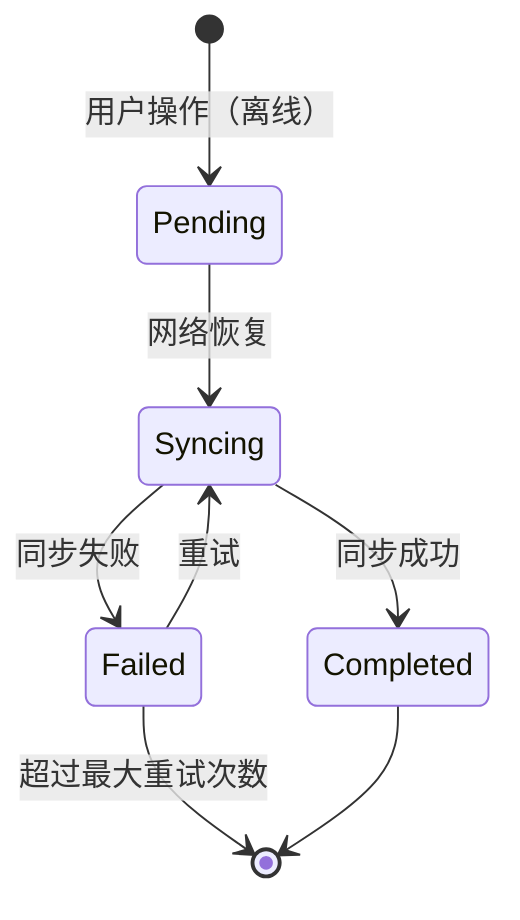

# 律时移动端 - 离线与同步策略

> **版本**: 1.0  
> **创建日期**: 2026-01-01

---

## 一、离线能力目标

| 目标 | 描述 | 优先级 |
|------|------|--------|
| **工时记录** | 断网时可创建工时，恢复后自动同步 | P0 |
| **任务更新** | 断网时可更新任务状态 | P0 |
| **数据浏览** | 断网时可查看已缓存的案件/任务列表 | P1 |
| **文档离线** | 标记为离线的文档可本地查看 | P2 |

---

## 二、本地存储方案

### 2.1 存储层次

```
┌─────────────────────────────────────────┐
│               应用层                     │
├─────────────────────────────────────────┤
│           数据访问层 (Repository)        │
├──────────┬──────────┬───────────────────┤
│  Hive    │ Secure   │  SQLite           │
│ (缓存)   │ Storage  │ (可选复杂查询)    │
│          │ (敏感)   │                   │
└──────────┴──────────┴───────────────────┘
```

### 2.2 存储选型

| 数据类型 | 存储方式 | 理由 |
|----------|----------|------|
| Token/密钥 | `flutter_secure_storage` | 加密存储 |
| 业务缓存 | Hive | 高性能、类型安全 |
| 离线队列 | Hive | 持久化操作队列 |
| 大文件 | 文件系统 + 元数据 Hive | 文档/图片缓存 |
| 复杂查询 | SQLite (drift) | 可选，用于搜索 |

---

## 三、离线队列机制

### 3.1 队列数据结构

```dart
// lib/core/storage/offline_queue.dart
@HiveType(typeId: 10)
class OfflineAction extends HiveObject {
  @HiveField(0)
  late String id;
  
  @HiveField(1)
  late String actionType;  // CREATE_TIMELOG, UPDATE_TASK, etc.
  
  @HiveField(2)
  late String payload;  // JSON 序列化的请求体
  
  @HiveField(3)
  late DateTime createdAt;
  
  @HiveField(4)
  late int retryCount;
  
  @HiveField(5)
  late OfflineActionStatus status;
}

enum OfflineActionStatus { pending, syncing, failed, completed }
```

### 3.2 队列处理流程



### 3.3 实现代码

```dart
class OfflineQueueService {
  final Box<OfflineAction> _box;
  final DioClient _api;
  
  // 入队
  Future<void> enqueue(OfflineAction action) async {
    action.id = const Uuid().v4();
    action.createdAt = DateTime.now();
    action.retryCount = 0;
    action.status = OfflineActionStatus.pending;
    await _box.add(action);
  }
  
  // 处理队列
  Future<void> processQueue() async {
    final pending = _box.values
        .where((a) => a.status == OfflineActionStatus.pending)
        .toList()
      ..sort((a, b) => a.createdAt.compareTo(b.createdAt));
    
    for (final action in pending) {
      try {
        action.status = OfflineActionStatus.syncing;
        await action.save();
        
        await _executeAction(action);
        
        action.status = OfflineActionStatus.completed;
        await action.delete();
      } catch (e) {
        action.retryCount++;
        action.status = action.retryCount >= 3 
            ? OfflineActionStatus.failed 
            : OfflineActionStatus.pending;
        await action.save();
      }
    }
  }
  
  Future<void> _executeAction(OfflineAction action) async {
    final payload = jsonDecode(action.payload);
    switch (action.actionType) {
      case 'CREATE_TIMELOG':
        await _api.post('/v1/timelogs', data: payload);
      case 'UPDATE_TASK':
        await _api.put('/v1/tasks/${payload['id']}', data: payload);
      // ...
    }
  }
}
```

---

## 四、数据缓存策略

### 4.1 缓存策略矩阵

| 数据类型 | TTL | 刷新策略 | 离线可用 |
|----------|-----|----------|----------|
| 用户信息 | 24h | 启动时刷新 | ✅ |
| 案件列表 | 10min | Pull-to-refresh | ✅ (最近50条) |
| 案件详情 | 10min | 进入时刷新 | ✅ (已访问) |
| 任务列表 | 5min | 实时更新 | ✅ |
| 工时记录 | 5min | Pull-to-refresh | ✅ |
| 聊天消息 | ∞ | 实时 WebSocket | ✅ (本地历史) |
| 文档元数据 | 10min | Pull-to-refresh | ✅ |
| 文档内容 | ∞ | 手动下载 | 仅标记离线 |

### 4.2 Repository 缓存实现

```dart
class CaseRepositoryImpl implements CaseRepository {
  final CaseApi _api;
  final CaseLocalDataSource _cache;
  final ConnectivityService _connectivity;

  @override
  Future<List<Case>> getCases({int page = 1}) async {
    // 有网络时：API 优先 + 缓存
    if (await _connectivity.hasConnection) {
      try {
        final remote = await _api.getCases(page: page);
        if (page == 1) {
          await _cache.setCases(remote);
        } else {
          await _cache.appendCases(remote);
        }
        return remote;
      } catch (e) {
        // API 失败，回退缓存
        return _cache.getCases();
      }
    }
    
    // 无网络：仅缓存
    return _cache.getCases();
  }
}
```

---

## 五、冲突解决策略

### 5.1 冲突场景

| 场景 | 描述 | 解决策略 |
|------|------|----------|
| **同数据多端编辑** | 移动端离线修改，Web端也修改 | 服务器优先 + 提示用户 |
| **乐观更新失败** | 本地先更新，同步失败 | 回滚本地 + 提示 |
| **离线删除** | 离线删除，服务器已被修改 | 硬删除 + 记录日志 |

### 5.2 冲突检测

```dart
class ConflictDetector {
  /// 检测版本冲突
  bool hasConflict<T extends Versioned>(T local, T remote) {
    return local.version != remote.version;
  }
  
  /// 解决策略
  T resolve<T extends Versioned>(T local, T remote, ConflictStrategy strategy) {
    switch (strategy) {
      case ConflictStrategy.serverWins:
        return remote;
      case ConflictStrategy.clientWins:
        return local;
      case ConflictStrategy.merge:
        return _mergeObjects(local, remote);
    }
  }
}

abstract class Versioned {
  int get version;
  DateTime get updatedAt;
}
```

---

## 六、网络状态监听

```dart
// lib/core/network/connectivity_service.dart
class ConnectivityService {
  final Connectivity _connectivity = Connectivity();
  final BehaviorSubject<bool> _connectionStatus = BehaviorSubject.seeded(true);
  
  Stream<bool> get connectionStream => _connectionStatus.stream;
  bool get isConnected => _connectionStatus.value;
  
  void init() {
    _connectivity.onConnectivityChanged.listen((result) {
      final hasConnection = result != ConnectivityResult.none;
      _connectionStatus.add(hasConnection);
      
      if (hasConnection) {
        // 网络恢复，触发同步
        GetIt.I<OfflineQueueService>().processQueue();
      }
    });
  }
}

// 在 UI 层使用
class OfflineIndicator extends ConsumerWidget {
  @override
  Widget build(BuildContext context, WidgetRef ref) {
    final isOnline = ref.watch(connectivityProvider);
    
    if (isOnline) return SizedBox.shrink();
    
    return Container(
      color: Colors.orange,
      padding: EdgeInsets.all(8),
      child: Row(
        mainAxisAlignment: MainAxisAlignment.center,
        children: [
          Icon(Icons.wifi_off, size: 16, color: Colors.white),
          SizedBox(width: 8),
          Text('离线模式 - 数据将在恢复网络后同步', 
               style: TextStyle(color: Colors.white)),
        ],
      ),
    );
  }
}
```

---

## 七、同步状态 UI

### 7.1 同步指示器

```dart
class SyncStatusWidget extends ConsumerWidget {
  @override
  Widget build(BuildContext context, WidgetRef ref) {
    final queueCount = ref.watch(offlineQueueCountProvider);
    final isSyncing = ref.watch(syncStatusProvider);
    
    if (queueCount == 0) return SizedBox.shrink();
    
    return Container(
      padding: EdgeInsets.symmetric(horizontal: 12, vertical: 6),
      decoration: BoxDecoration(
        color: LegalMindColors.primary50,
        borderRadius: BorderRadius.circular(16),
      ),
      child: Row(
        mainAxisSize: MainAxisSize.min,
        children: [
          if (isSyncing)
            SizedBox(
              width: 14, height: 14,
              child: CircularProgressIndicator(
                strokeWidth: 2,
                color: LegalMindColors.primary500,
              ),
            )
          else
            Icon(Icons.sync, size: 14, color: LegalMindColors.primary500),
          SizedBox(width: 6),
          Text(
            isSyncing ? '同步中...' : '$queueCount 项待同步',
            style: TextStyle(
              fontSize: 12,
              color: LegalMindColors.primary700,
            ),
          ),
        ],
      ),
    );
  }
}
```

---

## 八、数据清理策略

```dart
class CacheCleanupService {
  static const int maxCacheSizeMB = 500;
  static const int maxCacheAgeDays = 30;
  
  Future<void> cleanup() async {
    // 按 LRU 清理超过最大缓存的数据
    final cacheSize = await _calculateCacheSize();
    if (cacheSize > maxCacheSizeMB * 1024 * 1024) {
      await _evictLRU();
    }
    
    // 清理过期数据
    await _clearExpiredCache();
  }
  
  Future<void> _clearExpiredCache() async {
    final cutoff = DateTime.now().subtract(Duration(days: maxCacheAgeDays));
    final boxes = [casesBox, tasksBox, timelogsBox];
    for (final box in boxes) {
      final expired = box.values.where((e) => e.cachedAt.isBefore(cutoff));
      for (final item in expired) {
        await item.delete();
      }
    }
  }
}
```

---

**下一步**: 查看 [06_推送与通知设计.md](./06_推送与通知设计.md) 了解推送通知方案
